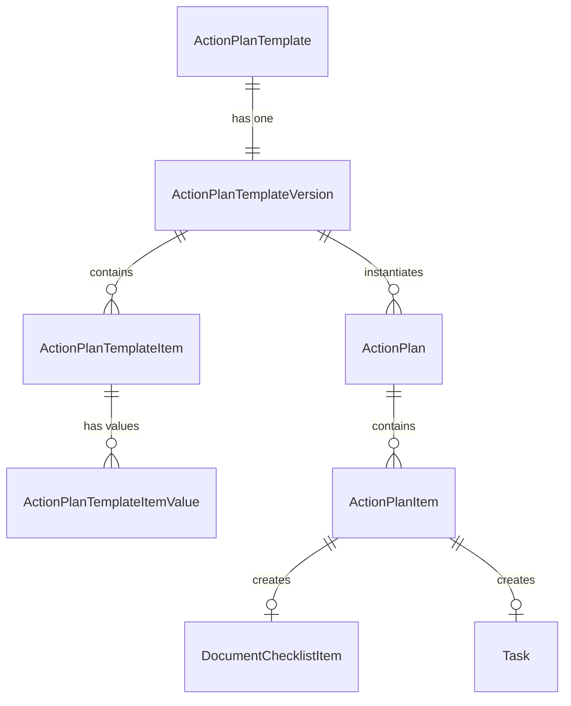

# sf-action-plans: Action Plan Templates & Document Checklists

Manage the full lifecycle of Salesforce Action Plan Templates — creation, publishing, modification, deactivation — and the Document Checklist Items they generate. This skill encodes hard-won production lessons about status transitions, deployment pitfalls, and the REST API workaround for template creation.

> **Cross-references:** This skill works with [`sf-deploy`](../sf-deploy/SKILL.md) for metadata retrieval, [`sf-flow`](../sf-flow/SKILL.md) for template assignment automation, [`sf-metadata`](../sf-metadata/SKILL.md) for custom fields on Action Plan objects, [`sf-data`](../sf-data/SKILL.md) for SOQL queries and data operations, [`sf-apex`](../sf-apex/SKILL.md) for programmatic template assignment, and [`sf-diagram`](../sf-diagram/SKILL.md) for ERD visualization of Action Plan hierarchies.

---

## Quick Reference

| Task | Command / Method |
|------|-----------------|
| Create template | `POST /services/data/v62.0/sobjects/ActionPlanTemplate` (REST API only) |
| Create item | `POST /services/data/v62.0/sobjects/ActionPlanTemplateItem` |
| Create item value | `POST /services/data/v62.0/sobjects/ActionPlanTemplateItemValue` |
| Publish template | Setup UI > Action Plan Templates > click template > **Publish Template** |
| Deactivate template | Setup UI > Action Plan Templates > click template > **Deactivate Template** |
| Retrieve to source | `sf project retrieve start -m ActionPlanTemplate -o <org-alias>` |
| Deploy (WARNING) | `sf project deploy start` creates **ReadOnly** templates -- avoid for creation |
| Query templates | `sf data query -q "SELECT Id, Name FROM ActionPlanTemplate" -o <alias>` |
| Query version status | `sf data query -q "SELECT Id, Status FROM ActionPlanTemplateVersion WHERE ActionPlanTemplate.Name = 'X'" -o <alias>` |
| Assign via Apex | Insert `ActionPlan` sObject with `ActionPlanTemplateVersionId` + `TargetId` + `StartDate` |
| Assign via Flow | Get Records (ActionPlanTemplateVersion WHERE Status='Final') then Create Records (ActionPlan) |
| Delete template | `sf data delete record -s ActionPlanTemplate -i <id> -o <alias>` (only if no active instances) |

---

## Core Responsibilities

1. **Template Creation**: Create Action Plan Templates via REST API (the only reliable method)
2. **Template Publishing**: Publish Draft templates to Final/Published via Setup UI
3. **Template Retrieval**: Retrieve templates into source control via Metadata API
4. **Template Lifecycle**: Deactivate, replace, and manage template versions
5. **Document Checklists**: Configure DocumentChecklistItem records for document collection workflows
6. **Action Plan Assignment**: Assign templates to records via Flow, Apex, or REST API
7. **Querying & Debugging**: Query template status, items, and instances

---

## CRITICAL: Creation vs Deployment

**Templates deployed via Metadata API (`sf project deploy start`) arrive in ReadOnly status.** ReadOnly templates CANNOT:
- Create Action Plans ("You can't create an action plan based on an inactive action plan template")
- Be changed to Draft or Final (status is immutable)
- Be published from the UI (no Publish button)

**The ONLY reliable creation method is REST API**, which creates templates in Draft status. Draft templates CAN be published from Setup UI.

```
Metadata API deploy → ReadOnly (DEAD END -- delete and recreate)
REST API POST       → Draft    → Publish from UI → Final/Published
```

Use Metadata API ONLY for retrieval into source control: `sf project retrieve start -m ActionPlanTemplate`

> **See also:** [`sf-deploy`](../sf-deploy/SKILL.md) for deployment commands and metadata retrieval patterns.

---

## Decision Framework: Action Plans vs Tasks vs Custom Objects

Use this table to decide whether Action Plans are the right tool for your requirement.

| Criteria | Action Plans (Industries) | Standard Tasks | Custom Object |
|----------|--------------------------|---------------|---------------|
| **Repeatable process** | YES -- template-driven | No -- manual each time | Custom build required |
| **Document collection** | YES -- native DCI support | No | Custom build required |
| **Multi-step workflow** | YES -- ordered items with dependencies | No -- flat list | Custom build required |
| **Compliance tracking** | YES -- built-in reporting | Limited | Custom build required |
| **Assignment rules** | Owner, Role, Queue, Creator | Owner only | Custom build required |
| **Deadline calculation** | YES -- offset from start date | Manual | Custom build required |
| **Available in FSC/HC/IGC** | YES -- native | YES | YES |
| **License requirement** | Industries Cloud or Action Plans feature | Standard | Standard |
| **Flexibility** | Fixed once published | High | Unlimited |
| **Custom fields** | Limited (no custom fields on ActionPlan) | YES | YES |
| **Programmatic creation** | Apex, Flow, REST API | Apex, Flow, REST API | Apex, Flow, REST API |

**Decision rule:**
- Use **Action Plans** when you need repeatable, template-driven processes with document collection, compliance tracking, or multi-step task sequences.
- Use **standard Tasks** for one-off reminders, ad-hoc follow-ups, or simple activity tracking.
- Use **Custom Objects** when you need custom fields, complex relationships, or business logic that exceeds what Action Plans support (e.g., approval processes on individual items, custom picklist values beyond the standard set).

---

## Object Hierarchy

```
ActionPlanTemplate
  +-- ActionPlanTemplateVersion (status lifecycle: Draft -> Final -> Obsolete)
        +-- ActionPlanTemplateItem (DCI, Task, Event, or RecordAction)
              +-- ActionPlanTemplateItemValue (field values for each item)

When instantiated on a record:
ActionPlan (on Account, Lead, Opportunity, etc.)
  +-- ActionPlanItem (ItemState: Pending -> InProgress -> Completed/Canceled)
        +-- DocumentChecklistItem | Task | Event | RecordAction (via ItemId)
```

### Key Fields

| Object | Field | Notes |
|--------|-------|-------|
| ActionPlanTemplate | `ActionPlanType` | `Industries` (supports DCIs) or `Standard` (Tasks only) |
| ActionPlanTemplate | `TargetEntityType` | `Account`, `Lead`, `Opportunity`, etc. |
| ActionPlanTemplate | `Description` | **Max 255 characters** |
| ActionPlanTemplateVersion | `Status` | `Draft`, `Final`, `ReadOnly`, `Obsolete` |
| ActionPlanTemplateItem | `ItemEntityType` | `DocumentChecklistItem`, `Task`, `Event`, `RecordAction` |
| ActionPlanTemplateItem | `DisplayOrder` | Integer controlling item sequence |
| ActionPlanTemplateItem | `UniqueName` | Stable identifier for the item |
| ActionPlanTemplateItemValue | `ItemEntityFieldName` | Full format: `Task.Description`, `DocumentChecklistItem.Instruction` |
| ActionPlanTemplateItemValue | `ItemEntityType` | **READ-ONLY** -- auto-inherited from parent item, do NOT include in POST |
| ActionPlan | `ActionPlanState` | NOT `Status` -- picklist: Not Started, In Progress, Completed, Canceled |
| ActionPlan | `StartDate` | **Required** for creation |
| DocumentChecklistItem | `ParentRecordId` | Links to Account (NOT ActionPlanId) |
| DocumentChecklistItem | `Status` | `New`, `Pending`, `Accepted`, `Rejected` |

---

## Limits and Constraints

| Constraint | Limit | Notes |
|-----------|-------|-------|
| Template description length | 255 characters | REST API returns error if exceeded |
| Versions per template | **1** | Cannot add a second version; error: "You can't add more than one version" |
| Template items (practical) | ~100 per template | No hard Salesforce limit documented, but UI performance degrades beyond ~100 items. Keep templates focused. |
| TargetEntityType options | 18+ standard objects + custom objects | Account, Lead, Opportunity, Case, Contact, Campaign, Contract, FinancialAccount, InsurancePolicy, Claim, and more |
| ActionPlan instances per record | No documented limit | Governed by standard Salesforce storage limits |
| Action Plan API availability | API v44.0+ | ActionPlanTemplate, ActionPlanTemplateVersion, ActionPlanTemplateItem, ActionPlanTemplateItemValue |
| DocumentChecklistItem API | API v47.0+ | Available with Financial Services Cloud, Health Cloud, or Industries Cloud |
| Publishing method | **UI only** | No REST, SOAP, Tooling, or Metadata API endpoint for publishing |
| Template editing after publish | **Not allowed** | Final/Published templates are immutable; create a replacement template |
| Deactivation reversibility | **Irreversible** | Obsolete status cannot be reverted to Final |
| Deletion with active instances | **Blocked** | Cannot delete templates that have active ActionPlan instances |
| DCI `ParentRecordId` targets | 53+ object types | Account, Lead, Opportunity, InsurancePolicy, Claim, etc. |
| Concurrent template edits | Single-user | No collaborative editing; last save wins on Draft templates |

---

## Workflow: Creating Templates

### Step 1: Create via REST API

Create the template, then query for the auto-created version:

```python
# POST /services/data/v62.0/sobjects/ActionPlanTemplate
{
    "Name": "My Template",
    "ActionPlanType": "Industries",    # Required for DCI support
    "TargetEntityType": "Account",
    "Description": "Max 255 chars"     # Will error if longer
}

# Query the auto-created version (wait ~1s)
# SELECT Id FROM ActionPlanTemplateVersion WHERE ActionPlanTemplateId = '<id>'
```

### Step 2: Create Items

```python
# POST /services/data/v62.0/sobjects/ActionPlanTemplateItem
{
    "ActionPlanTemplateVersionId": "<version_id>",
    "Name": "Broker Agreement",
    "DisplayOrder": 1,
    "IsRequired": true,
    "ItemEntityType": "DocumentChecklistItem",  # or "Task"
    "UniqueName": "my_dci_broker_agreement",
    "IsActive": true
}
```

### Step 3: Create Item Values

```python
# POST /services/data/v62.0/sobjects/ActionPlanTemplateItemValue
{
    "ActionPlanTemplateItemId": "<item_id>",
    "ItemEntityFieldName": "DocumentChecklistItem.Name",   # Full qualified format
    "ValueLiteral": "Broker Agreement",
    "Name": "Name",
    "IsActive": true
    # Do NOT include ItemEntityType -- it is read-only
}
```

**Common field names by entity type:**

| Entity Type | Available Fields |
|-------------|-----------------|
| DocumentChecklistItem | `Name`, `Status`, `Instruction` |
| Task | `Subject`, `Priority`, `Status`, `Description`, **`ActivityDate`** (ValueFormula!), `IsReminderSet`, `ReminderDateTime` |
| Event | `Subject`, `Description`, `Location` |

### Step 4: Publish from UI

1. Navigate to **Setup > Action Plan Templates**
2. Click the template name
3. Click **Publish Template**
4. Confirm in the dialog
5. Status changes from Draft -> Published (Final)

**There is no API method to publish.** The UI is required.

### Step 5: Retrieve into Source Control

```bash
sf project retrieve start -m ActionPlanTemplate -o <org-alias>
```

Files land in `force-app/main/default/actionPlanTemplates/` as `.apt-meta.xml`.

> **See also:** [`sf-deploy`](../sf-deploy/SKILL.md) for full retrieval and deployment patterns.

---

## Workflow: Replacing Published Templates

Published (Final) templates **cannot be modified**. To update content:

1. Create a NEW template via REST API with the same `Name`
2. Add all items and values
3. Publish the new template from UI
4. Deactivate the old template from UI -> status becomes Obsolete
5. Delete the old template (only if no active ActionPlan instances reference it)

**If active instances exist**, the old template cannot be deleted -- leave it as Obsolete.

**Flows that assign templates by Name** (not ID) will automatically pick up the new template once it's the only Final version with that name.

---

## Workflow: Assigning Templates via Flow

Query for the published template version, then create an ActionPlan:

```
// In Flow (Record-Triggered or Screen)
// 1. Get Records: ActionPlanTemplate WHERE Name = 'My Template'
// 2. Get Records: ActionPlanTemplateVersion WHERE ActionPlanTemplateId = {templateId} AND Status = 'Final'
// 3. Create Records: ActionPlan
//      Name = 'My Plan'
//      ActionPlanTemplateVersionId = {versionId}
//      TargetId = {recordId}
//      StartDate = {TODAY}
//      ActionPlanType = 'Industries'
//      ActionPlanState = 'Not Started'
```

> **See also:** [`sf-flow`](../sf-flow/SKILL.md) for Screen Flow and Record-Triggered Flow patterns.

---

## Workflow: Assigning Templates via Apex

Use Apex to programmatically assign Action Plan Templates to records. This is essential for bulk operations, trigger-based assignment, and complex business logic.

### Basic Apex Assignment

```apex
/**
 * Assigns an Action Plan Template to a target record.
 * Requires the template to be in Final/Published status.
 */
public class ActionPlanService {

    /**
     * Create an Action Plan from a published template.
     * @param templateName  The Name of the ActionPlanTemplate
     * @param targetId      The record to assign the plan to (Account, Lead, etc.)
     * @return ActionPlan   The created ActionPlan record
     */
    public static ActionPlan assignTemplate(String templateName, Id targetId) {
        // Query the published template version
        ActionPlanTemplateVersion version = [
            SELECT Id, ActionPlanTemplateId, ActionPlanTemplate.ActionPlanType
            FROM ActionPlanTemplateVersion
            WHERE ActionPlanTemplate.Name = :templateName
              AND Status = 'Final'
            LIMIT 1
        ];

        // Create the Action Plan instance
        ActionPlan plan = new ActionPlan(
            Name                         = templateName + ' - ' + Date.today().format(),
            ActionPlanTemplateVersionId   = version.Id,
            TargetId                      = targetId,
            StartDate                     = Date.today(),
            ActionPlanType                = version.ActionPlanTemplate.ActionPlanType,
            ActionPlanState               = 'Not Started'
        );

        insert plan;
        return plan;
    }
}
```

### Bulk Apex Assignment (Trigger or Batch)

```apex
/**
 * Bulk-assigns Action Plans to multiple records.
 * Use in triggers, batch Apex, or scheduled jobs.
 * Follows PS Advisory conventions: no SOQL/DML in loops.
 *
 * See also: sf-apex skill for Apex patterns and sf-data skill for SOQL.
 */
public class ActionPlanBulkService {

    public static List<ActionPlan> assignTemplateToRecords(
        String templateName,
        List<Id> targetIds
    ) {
        // Single query for the template version
        ActionPlanTemplateVersion version = [
            SELECT Id, ActionPlanTemplateId, ActionPlanTemplate.ActionPlanType
            FROM ActionPlanTemplateVersion
            WHERE ActionPlanTemplate.Name = :templateName
              AND Status = 'Final'
            LIMIT 1
        ];

        // Build all Action Plans in memory (no DML in loop)
        List<ActionPlan> plans = new List<ActionPlan>();
        for (Id targetId : targetIds) {
            plans.add(new ActionPlan(
                Name                         = templateName + ' - ' + Date.today().format(),
                ActionPlanTemplateVersionId   = version.Id,
                TargetId                      = targetId,
                StartDate                     = Date.today(),
                ActionPlanType                = version.ActionPlanTemplate.ActionPlanType,
                ActionPlanState               = 'Not Started'
            ));
        }

        insert plans;
        return plans;
    }
}
```

### Apex Test Class

```apex
@IsTest
private class ActionPlanServiceTest {

    @TestSetup
    static void setup() {
        // Action Plan Templates cannot be created in test context via DML.
        // Use @TestVisible or mock patterns. In integration tests against
        // a real org, ensure a published template exists.
    }

    @IsTest
    static void testAssignTemplate() {
        // Create test Account
        Account acc = new Account(Name = 'Test Account');
        insert acc;

        // In a real test, you would query an existing published template.
        // Action Plan objects are not DML-creatable in pure unit tests
        // without SeeAllData=true or an existing template in the org.
        //
        // Integration test pattern:
        // ActionPlan result = ActionPlanService.assignTemplate(
        //     'Agency Onboarding - Independent',
        //     acc.Id
        // );
        // System.assertNotEquals(null, result.Id);
        // System.assertEquals('Not Started', result.ActionPlanState);
    }
}
```

> **Testing note:** ActionPlanTemplate, ActionPlanTemplateVersion, and related objects are not DML-creatable in Apex test context. Integration tests that use `@IsTest(SeeAllData=true)` or org-specific test utilities are required. See [`sf-testing`](../sf-testing/SKILL.md) for test patterns.

> **See also:** [`sf-apex`](../sf-apex/SKILL.md) for Apex class conventions, bulkification, and trigger architecture.

---

## Error Patterns

Common errors encountered when working with Action Plan Templates and their resolutions.

| Error Message | Cause | Resolution |
|---------------|-------|------------|
| `"You can't create an action plan based on an inactive action plan template. Select an action plan template version with a status of Published and try again."` | ActionPlanTemplateVersion status is not `Final` (Draft, ReadOnly, or Obsolete) | Ensure the template version has `Status = 'Final'`. If ReadOnly (from metadata deploy), delete and recreate via REST API. |
| `"You can't add more than one version to this action plan template."` | Attempted to insert a second ActionPlanTemplateVersion for a template | Each template supports exactly one version. Query the existing version instead of creating a new one. |
| `"Required fields are missing: [ActionPlanType]"` | ActionPlan creation without `ActionPlanType` field (known issue since Winter '20) | Always include `ActionPlanType` ('Industries' or 'Standard') when creating ActionPlan records. |
| `"Required fields are missing: [StartDate]"` | ActionPlan creation without `StartDate` | Always include `StartDate` (Date field) when inserting ActionPlan records. |
| `STRING_TOO_LONG: Description` | Template Description exceeds 255 characters | Shorten the Description to 255 characters or fewer. |
| `INVALID_FIELD_FOR_INSERT_UPDATE: ItemEntityType` on ActionPlanTemplateItemValue | Included `ItemEntityType` in the POST body for item values | Remove `ItemEntityType` from the payload. It is **read-only** and auto-inherited from the parent ActionPlanTemplateItem. |
| `FIELD_INTEGRITY_EXCEPTION: ActionPlanTemplateVersionId` | Referenced a version ID that does not exist or is from a different template | Verify the version ID by querying: `SELECT Id FROM ActionPlanTemplateVersion WHERE ActionPlanTemplateId = '<template_id>'` |
| `DUPLICATE_VALUE: UniqueName` | Two items on the same template version share the same `UniqueName` | Use unique values for `UniqueName` across all items in a template version. |
| `"You can't change the status on read-only templates"` | Attempted to modify a ReadOnly template version (created by metadata deploy) | Delete the template and recreate via REST API. ReadOnly is a dead-end status. |
| `ENTITY_IS_DELETED` or `DELETE_FAILED` on template | Attempted to delete a template with active ActionPlan instances | Deactivate the template instead (-> Obsolete). Active instances prevent deletion. Query: `SELECT COUNT() FROM ActionPlan WHERE ActionPlanTemplateVersionId IN (SELECT Id FROM ActionPlanTemplateVersion WHERE ActionPlanTemplateId = '<id>')` |
| `INSUFFICIENT_ACCESS_OR_READONLY` | User lacks permission to Action Plan objects | Assign the `ActionPlans` or `IndustriesActionPlans` permission set. See [`sf-metadata`](../sf-metadata/SKILL.md) for permission set configuration. |
| `Action Plan Template Version ID: id value of incorrect type` | Passed an ActionPlanTemplate ID where ActionPlanTemplateVersion ID is expected | The `ActionPlanTemplateVersionId` field on ActionPlan requires the **version** ID (prefix `0e1`), not the template ID (prefix `0e0`). Query the version first. |

---

## Querying

```bash
# List all templates with status
sf data query -q "SELECT Id, Name, Description FROM ActionPlanTemplate" -o <alias>

# Check version status (Final = Published, usable)
sf data query -q "SELECT Id, ActionPlanTemplateId, Status FROM ActionPlanTemplateVersion WHERE ActionPlanTemplate.Name = 'My Template'" -o <alias>

# Count items on a template version
sf data query -q "SELECT Id, Name, ItemEntityType, DisplayOrder FROM ActionPlanTemplateItem WHERE ActionPlanTemplateVersionId = '<version_id>' ORDER BY DisplayOrder" -o <alias>

# Check Action Plans on an Account
sf data query -q "SELECT Id, Name, ActionPlanState FROM ActionPlan WHERE TargetId = '<account_id>'" -o <alias>

# Check Document Checklist Items on an Account
sf data query -q "SELECT Id, Name, Status, ParentRecordId FROM DocumentChecklistItem WHERE ParentRecordId = '<account_id>'" -o <alias>

# Find all ReadOnly templates (broken state from metadata deploy)
sf data query -q "SELECT ActionPlanTemplate.Name, Status FROM ActionPlanTemplateVersion WHERE Status = 'ReadOnly'" -o <alias>

# Count active Action Plans per template
sf data query -q "SELECT ActionPlanTemplateVersion.ActionPlanTemplate.Name, COUNT(Id) FROM ActionPlan WHERE ActionPlanState != 'Canceled' GROUP BY ActionPlanTemplateVersion.ActionPlanTemplate.Name" -o <alias>
```

> **See also:** [`sf-data`](../sf-data/SKILL.md) for SOQL query patterns and [`sf-soql`](../sf-soql/SKILL.md) for query optimization.

---

## Gotchas

| Gotcha | Details |
|--------|---------|
| Metadata deploy = ReadOnly | `sf project deploy start` creates ReadOnly templates. Use REST API instead. |
| Description max 255 chars | Template `Description` field truncates/errors above 255 characters |
| ItemEntityType is read-only on values | Do NOT include `ItemEntityType` in ActionPlanTemplateItemValue POST payload |
| Only one version per template | Cannot create a second version -- error: "You can't add more than one version" |
| Published = immutable | Final/Published templates cannot be edited. Create new template to replace. |
| Deactivation is permanent | Obsolete status cannot be reverted. Template is dead. |
| Deletion blocked by instances | Templates with active ActionPlan instances cannot be deleted |
| ActionPlanState not Status | The API field is `ActionPlanState`, not `Status`. UI shows "Status" but API differs. |
| DCI ParentRecordId | DocumentChecklistItem links to Account via `ParentRecordId`, NOT `ActionPlanId` |
| Industries type required for DCIs | Standard Action Plans don't support Document Checklist Items. Must use `Industries` type. |
| Template must be Final for flows | Templates in Draft/ReadOnly status can't be auto-assigned by flows |
| No API publish method | Templates can ONLY be published from Setup UI. No REST/SOAP/Tooling API endpoint exists. |
| StartDate required | ActionPlan creation fails without `StartDate` field |
| `isAdHocItemCreationEnabled` | Set to `false` to prevent users from adding custom items to plans |
| **Task.ActivityDate required** | **Tasks won't render in UI without `Task.ActivityDate` ValueFormula (`StartDate + <days>`).** Also include `Task.IsReminderSet` and `Task.ReminderDateTime`. |
| Task.Status not needed for UI | `Task.Status` is not required for UI rendering -- `Task.ActivityDate` is the critical field |
| Test context limitations | ActionPlanTemplate objects cannot be created via DML in Apex test context. Use integration tests or `SeeAllData=true`. |
| Version ID prefix confusion | ActionPlanTemplate ID prefix is `0e0`; ActionPlanTemplateVersion prefix is `0e1`. Passing the wrong one causes type mismatch errors. |

---

## Supported Target Entity Types

Action Plan Templates can target 18+ object types. Common values for `TargetEntityType`:

| Object | API Name | Notes |
|--------|----------|-------|
| Account | `Account` | Most common target |
| Lead | `Lead` | Pre-conversion onboarding |
| Opportunity | `Opportunity` | Sales process checklists |
| Case | `Case` | Support process workflows |
| Contact | `Contact` | Individual engagement |
| Campaign | `Campaign` | Campaign execution checklists |
| Contract | `Contract` | Contract lifecycle |
| Financial Account | `FinServ__FinancialAccount__c` | FSC-specific |
| Financial Deal | `FinServ__FinancialDeal__c` | FSC-specific |
| Insurance Policy | `InsurancePolicy` | Insurance Cloud |
| Claim | `Claim` | Insurance Cloud |
| Custom Objects | `MyCustomObject__c` | Requires configuration |

---

## Integration with Other Skills

### With sf-flow (Template Auto-Assignment)

Use Record-Triggered Flows to auto-assign templates when records are created or meet criteria. See [`sf-flow`](../sf-flow/SKILL.md) for flow building patterns.

```
// Record-Triggered Flow on Account (After Create)
// Condition: Account.Type = 'Broker'
// 1. Get Records: ActionPlanTemplate WHERE Name = 'Broker Onboarding'
// 2. Get Records: ActionPlanTemplateVersion WHERE ActionPlanTemplateId = {!template.Id} AND Status = 'Final'
// 3. Create Records: ActionPlan with TargetId = {!$Record.Id}
```

### With sf-deploy (Metadata Retrieval)

Always retrieve templates AFTER publishing them in the org. Never deploy templates expecting them to be usable. See [`sf-deploy`](../sf-deploy/SKILL.md).

```bash
# Retrieve all Action Plan Templates
sf project retrieve start -m ActionPlanTemplate -o <org-alias>

# Retrieve specific template by name
sf project retrieve start -m "ActionPlanTemplate:My_Template" -o <org-alias>
```

### With sf-metadata (Custom Fields and Permission Sets)

Action Plan objects support standard fields only -- you cannot add custom fields to `ActionPlan` or `ActionPlanItem`. However, you can add custom fields to `DocumentChecklistItem` for extended document tracking. See [`sf-metadata`](../sf-metadata/SKILL.md).

Permission sets required:
- `ActionPlans` -- Standard Action Plans
- `IndustriesActionPlans` -- Industries Action Plans with DCI support
- `DocumentChecklist` -- DocumentChecklistItem access

### With sf-diagram (Architecture Visualization)

Use [`sf-diagram`](../sf-diagram/SKILL.md) to generate Mermaid ERD diagrams for Action Plan object hierarchies:



---

## References

### Internal

| Resource | Path |
|----------|------|
| Deployed Templates | `references/deployed-templates.md` -- IDs, items, instructions for all production templates |
| Object Schema | `references/object-schema.md` -- Complete field reference for all 7 Action Plan objects |
| Status Lifecycle | `references/status-lifecycle.md` -- Template version status state machine |
| Creation Script | `scripts/create_action_plan_template.py` -- Production-tested Python REST API script |

### External (Salesforce Documentation)

| Resource | URL |
|----------|-----|
| ActionPlanTemplate Object Reference | https://developer.salesforce.com/docs/atlas.en-us.object_reference.meta/object_reference/sforce_api_objects_actionplantemplate.htm |
| ActionPlan Object Reference | https://developer.salesforce.com/docs/atlas.en-us.object_reference.meta/object_reference/sforce_api_objects_actionplan.htm |
| ActionPlanTemplateVersion Object Reference | https://developer.salesforce.com/docs/atlas.en-us.object_reference.meta/object_reference/sforce_api_objects_actionplantemplateversion.htm |
| ActionPlanTemplateItem Object Reference | https://developer.salesforce.com/docs/atlas.en-us.object_reference.meta/object_reference/sforce_api_objects_actionplantemplateitem.htm |
| ActionPlanTemplateItemValue Object Reference | https://developer.salesforce.com/docs/atlas.en-us.object_reference.meta/object_reference/sforce_api_objects_actionplantemplateitemvalue.htm |
| ActionPlanItem Object Reference | https://developer.salesforce.com/docs/atlas.en-us.object_reference.meta/object_reference/sforce_api_objects_actionplanitem.htm |
| ActionPlanTemplate Metadata API | https://developer.salesforce.com/docs/atlas.en-us.api_meta.meta/api_meta/meta_actionplantemplate.htm |
| Action Plan Templates REST API (Connect) | https://developer.salesforce.com/docs/atlas.en-us.psc_api.meta/psc_api/connect_resources_action_plan_template.htm |
| DocumentChecklistItem (FSC) | https://developer.salesforce.com/docs/atlas.en-us.financial_services_cloud_object_reference.meta/financial_services_cloud_object_reference/sforce_api_objects_documentchecklistitem.htm |
| Action Plans Data Model (Help) | https://help.salesforce.com/s/articleView?id=sf.fsc_action_plans_data_model.htm&language=en_US&type=5 |
| Action Plans Overview (Help) | https://help.salesforce.com/s/articleView?language=en_US&type=5&id=sf.fsc_action_plans.htm |
| Considerations for Creating Templates | https://help.salesforce.com/apex/HTViewHelpDoc?id=fsc_action_plans_create_templates.htm |
| Update API Implementations | https://help.salesforce.com/s/articleView?language=en_US&id=sf.fsc_action_plans_update_api_implementations.htm&type=5 |
| Action Plans Trailhead Module | https://trailhead.salesforce.com/content/learn/modules/action-plans-in-financial-services-cloud/learn-about-action-plans |
| Known Issue: ActionPlanType Required | https://trailblazer.salesforce.com/issues_view?id=a1p3A0000003eyUQAQ |
