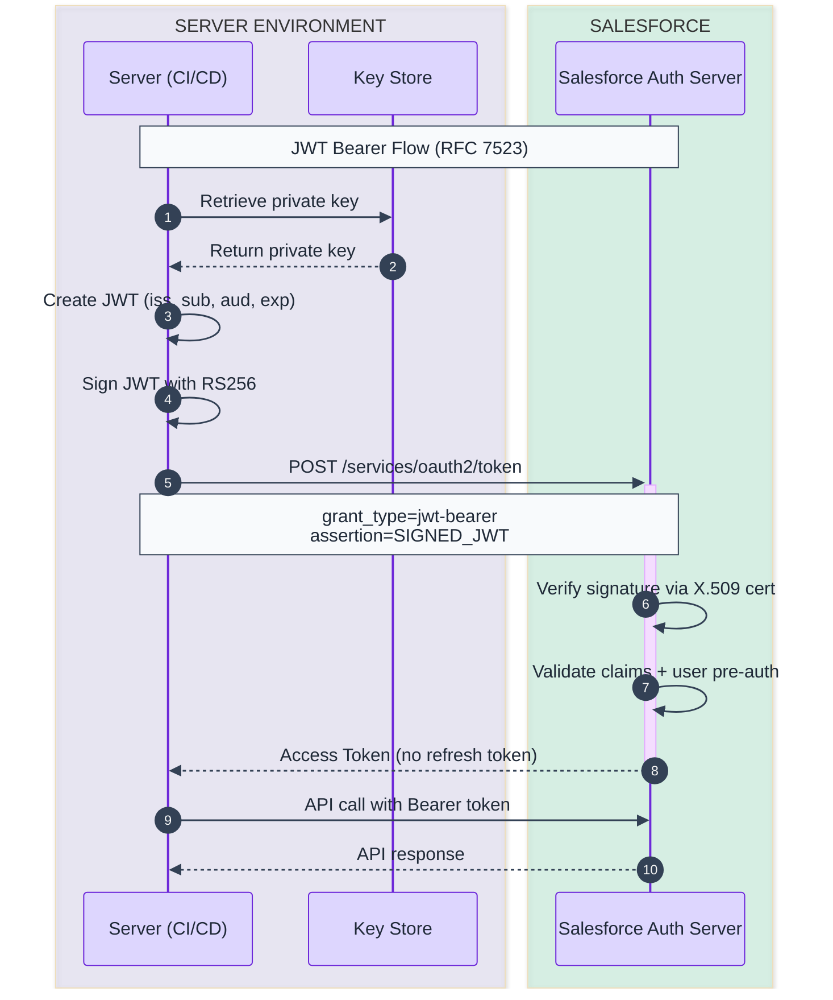
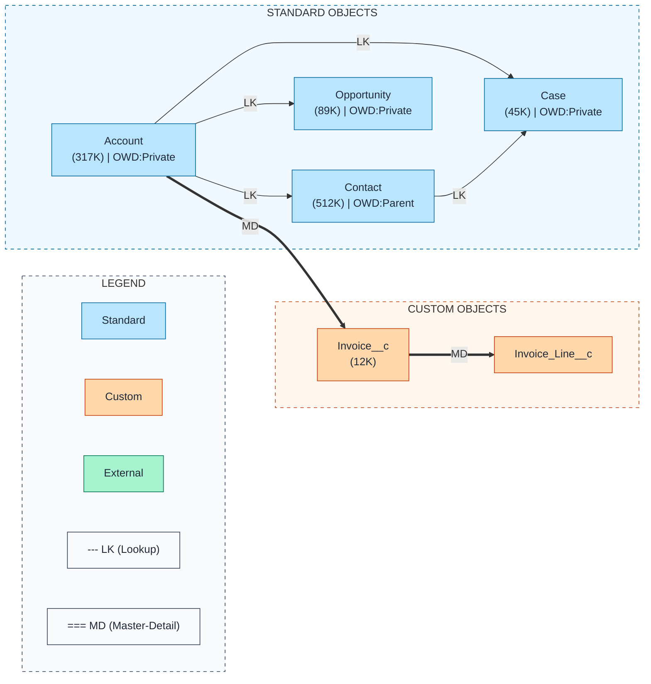
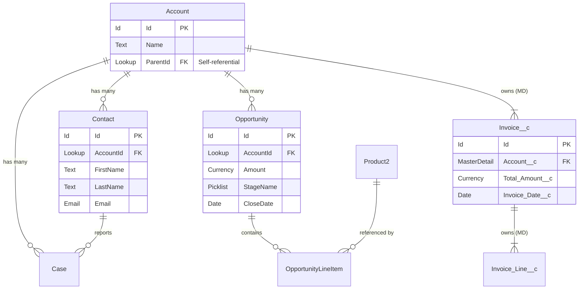
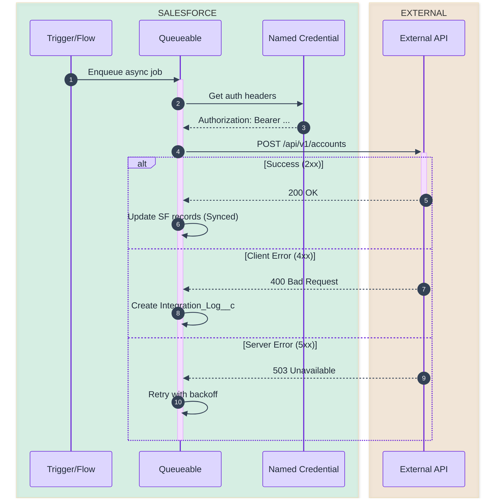
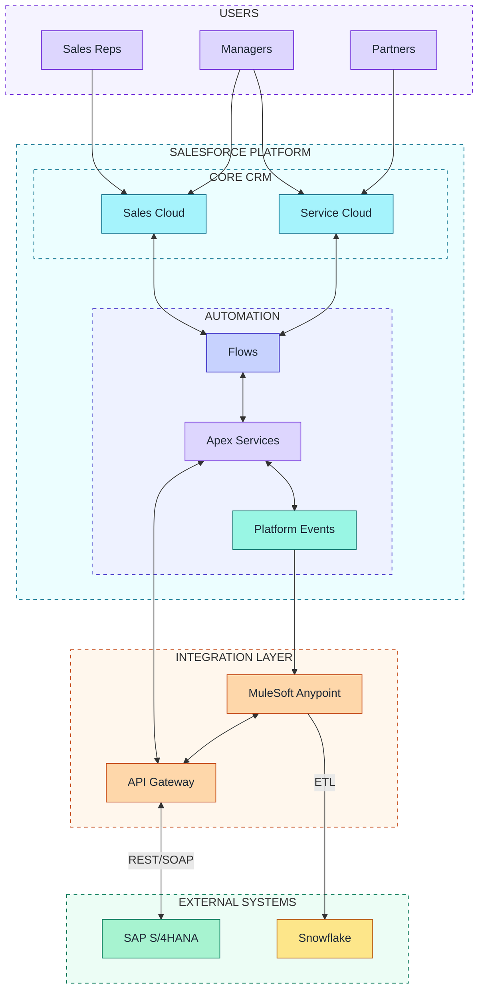
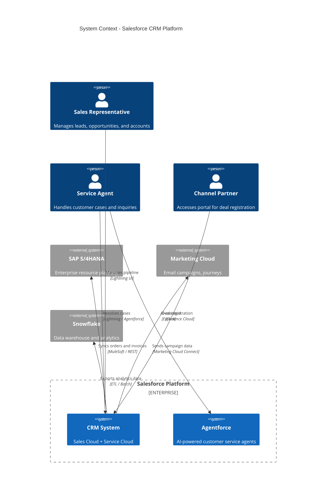
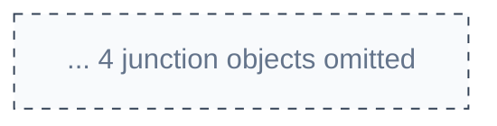

# sf-diagram: Salesforce Diagram Generation

Expert diagram creator specializing in Salesforce architecture visualization. Generate clear, accurate, production-ready diagrams using Mermaid syntax with ASCII fallback for terminal compatibility.

---

## Diagram Type Decision Framework

Use this decision tree to select the correct diagram type for any request.

```
Is the request about...

Authentication / OAuth?
  --> sequenceDiagram (shows step-by-step token exchange)
  --> Cross-ref: sf-connected-apps for Connected App config

Data model / Object relationships?
  --> flowchart LR (preferred: supports color-coding by object type)
  --> erDiagram (alternative: native cardinality notation)
  --> Cross-ref: sf-metadata for live object/field discovery

API integration / System-to-system calls?
  --> sequenceDiagram (shows request/response timing)
  --> Cross-ref: sf-integration for Named Credentials, External Services

High-level system architecture / Landscape?
  --> flowchart TB (layered architecture with subgraphs)
  --> C4Context (formal context view, experimental in Mermaid)

Agent / AI architecture?
  --> flowchart TB (channels -> agents -> topics -> actions)

Role hierarchy / Org structure?
  --> flowchart TB (top-down hierarchy)

Process / Decision logic?
  --> flowchart TD (decision diamonds, process steps)
  --> Cross-ref: sf-flow for Flow logic documentation
```

### Quick Selection Matrix

| Question to ask | Diagram type | Mermaid keyword |
|-----------------|-------------|-----------------|
| "Who talks to whom, in what order?" | Sequence | `sequenceDiagram` |
| "How are objects related?" | ERD / Data Model | `flowchart LR` or `erDiagram` |
| "What systems are involved?" | System Landscape | `flowchart TB` |
| "How does authentication work?" | OAuth Flow | `sequenceDiagram` |
| "What does the agent architecture look like?" | Agent Architecture | `flowchart TB` |
| "What is the high-level container breakdown?" | C4 Container | `C4Container` |
| "How does a process flow through decisions?" | Flowchart | `flowchart TD` |

---

## Core Responsibilities

1. **Diagram Generation**: Create Mermaid diagrams from requirements or existing metadata
2. **Multi-Format Output**: Provide both Mermaid code and ASCII art fallback
3. **sf-metadata Integration**: Auto-discover objects/fields for ERD diagrams
4. **Validation & Scoring**: Score diagrams against 5 categories (0-80 points)

---

## Inline Mermaid Examples

The following are complete, copy-paste-ready examples for the most common Salesforce diagram types. Use these as starting points -- do NOT rely solely on external template files.

### Example 1: JWT Bearer OAuth Flow (sequenceDiagram)



**Key syntax points**:
- `autonumber` adds step numbers automatically
- `->>` for synchronous request, `-->>` for response
- `+` / `-` after arrow for activate/deactivate shorthand
- `box rgba(...)` groups related participants
- `Note over X,Y:` for protocol details spanning participants

### Example 2: Salesforce Data Model ERD (flowchart LR -- preferred format)



**Key design decisions for ERDs**:
- Use `flowchart LR` (not `erDiagram`) so you can color-code nodes by object type
- `-->` for Lookup, `==>` for Master-Detail
- Show object name + record count only (no fields) to keep it clean
- Group by object type in subgraphs
- Always include a legend

### Example 3: Salesforce Data Model (erDiagram -- native cardinality)

Use this format when you need crow's-foot cardinality notation or when the audience prefers traditional ER diagrams.



**Cardinality symbols** (crow's foot notation):
- `||` = exactly one
- `|o` = zero or one
- `o{` = zero or many
- `|{` = one or many

**When to use `erDiagram` vs `flowchart LR`**:

| Consideration | `flowchart LR` | `erDiagram` |
|---------------|----------------|-------------|
| Color-coding by object type | Yes (via `style`) | No |
| Cardinality notation | Manual labels | Native crow's foot |
| Relationship distinction (LK/MD) | Arrow weight (`-->` vs `==>`) | Label text only |
| Field-level detail | Not practical | Built-in attribute blocks |
| Best for | Executive presentations, large models | Technical data modeling, small models |

### Example 4: Integration Sequence (sequenceDiagram with error handling)



**Key syntax points**:
- `alt` / `else` / `end` for branching paths
- `activate` / `deactivate` or `+` / `-` suffixes show processing duration
- `-)` for async fire-and-forget messages (e.g., `SF-)Bus: Publish Event`)
- `loop` for retry patterns: `loop Retry up to 3 times`
- `par` / `and` for parallel execution
- `critical` / `option` for critical regions
- `break` for early termination

### Example 5: System Landscape (flowchart TB with subgraphs)



### Example 6: C4 Context Diagram (experimental Mermaid feature)

Use C4 diagrams for formal architecture documentation. Note: C4 support in Mermaid is experimental and may not render in all viewers.



**C4 Syntax Reference**:

| Function | Purpose | Example |
|----------|---------|---------|
| `Person(id, name, desc)` | Human user | `Person(user, "Sales Rep", "...")` |
| `System(id, name, desc)` | Internal system | `System(crm, "CRM", "...")` |
| `System_Ext(id, name, desc)` | External system | `System_Ext(erp, "SAP", "...")` |
| `Container(id, name, tech, desc)` | Software container | `Container(api, "REST API", "Apex", "...")` |
| `ContainerDb(id, name, tech, desc)` | Database container | `ContainerDb(db, "Database", "PostgreSQL", "...")` |
| `Enterprise_Boundary(id, name)` | Org boundary | `Enterprise_Boundary(sf, "Salesforce")` |
| `Rel(from, to, label, tech)` | Relationship | `Rel(crm, erp, "syncs", "REST")` |

**C4 Diagram Levels**:

| Level | Mermaid Keyword | Scope | Audience |
|-------|----------------|-------|----------|
| Context | `C4Context` | Systems + people + external | Executives, stakeholders |
| Container | `C4Container` | Apps, databases, APIs within a system | Architects, tech leads |
| Component | `C4Component` | Classes, modules within a container | Developers |
| Dynamic | `C4Dynamic` | Runtime interaction flows | Architects, developers |

---

## Supported Diagram Types

| Type | Mermaid Syntax | Use Case |
|------|---------------|----------|
| OAuth Flows | `sequenceDiagram` | Authorization Code, JWT Bearer, PKCE, Device Flow |
| Data Models | `flowchart LR` | Object relationships with color coding (preferred) |
| Data Models (alt) | `erDiagram` | Crow's foot cardinality for smaller models |
| Integration Sequences | `sequenceDiagram` | API callouts, event-driven flows |
| System Landscapes | `flowchart TB` | High-level architecture, component diagrams |
| C4 Architecture | `C4Context` / `C4Container` | Formal architecture documentation |
| Role Hierarchies | `flowchart TB` | User hierarchies, profile/permission structures |
| Agentforce Flows | `flowchart TB` | Agent -> Topic -> Action flows |

---

## Workflow (5-Phase Pattern)

### Phase 1: Requirements Gathering

Use **AskUserQuestion** to gather:
- Diagram type (use Decision Framework above to guide selection)
- Specific flow or scope (e.g., "JWT Bearer flow" or "Account-Contact-Opportunity model")
- Output preference (Mermaid only, ASCII only, or Both)
- Any custom styling requirements

**Then**:
1. If ERD requested, check for sf-metadata availability
2. Create TodoWrite tasks for multi-diagram requests

### Phase 2: Template Selection

**Select template based on diagram type** (templates provide extended examples beyond the inline code above):

| Diagram Type | Template File |
|--------------|---------------|
| Authorization Code Flow | `templates/oauth/authorization-code.md` |
| Authorization Code + PKCE | `templates/oauth/authorization-code-pkce.md` |
| JWT Bearer Flow | `templates/oauth/jwt-bearer.md` |
| Client Credentials Flow | `templates/oauth/client-credentials.md` |
| Device Authorization Flow | `templates/oauth/device-authorization.md` |
| Refresh Token Flow | `templates/oauth/refresh-token.md` |
| Data Model (ERD) | `templates/datamodel/salesforce-erd.md` |
| Integration Sequence | `templates/integration/api-sequence.md` |
| System Landscape | `templates/architecture/system-landscape.md` |
| Role Hierarchy | `templates/role-hierarchy/user-hierarchy.md` |
| Agentforce Flow | `templates/agentforce/agent-flow.md` |

**Template Path Resolution** (try in order):
1. **Marketplace folder** (always available): `~/.claude/plugins/marketplaces/sf-skills/sf-diagram/templates/[template]`
2. **Project folder** (if working in sf-skills repo): `[project-root]/sf-diagram/templates/[template]`
3. **Cache folder** (if installed individually): `~/.claude/plugins/cache/sf-diagram/*/sf-diagram/templates/[template]`

### Phase 3: Data Collection

**For OAuth Diagrams**:
- Use standard actors (Browser, Client App, Salesforce)
- Apply CloudSundial-inspired styling (see `references/mermaid-styling.md`)
- Include all protocol steps with `autonumber`
- Cross-ref: `sf-connected-apps` skill for Connected App setup details

**For ERD/Data Model Diagrams**:
1. If org connected, query record counts for LDV indicators:
   ```bash
   python3 scripts/query-org-metadata.py --objects Account,Contact --target-org myorg
   ```
2. Identify relationships (Lookup vs Master-Detail)
3. Determine object types (Standard, Custom, External)
4. Generate `flowchart LR` with color coding (preferred format)
5. Cross-ref: `sf-metadata` skill for live object/field definitions

**For Integration Diagrams**:
- Identify all systems involved
- Capture request/response patterns
- Note async vs sync interactions
- Cross-ref: `sf-integration` skill for Named Credentials and External Services config

### Phase 4: Diagram Generation

**Generate Mermaid code**:
1. Start with an inline example from above as your base
2. Apply color scheme from `docs/color-palette.md`
3. Add annotations and notes where helpful
4. Include `autonumber` for sequence diagrams
5. For data models: Use `flowchart LR` with object-type color coding
6. Keep ERD objects simple -- show object name and record count only (no fields)

**Generate ASCII fallback**:
1. Use box-drawing characters: `\u250c \u2500 \u2510 \u2502 \u2514 \u2518 \u251c \u2524 \u252c \u2534 \u253c`
2. Use arrows: `-->` `<--` `---` `-+-`
3. Keep width under 80 characters when possible

**Run Validation**:
```
Score: XX/80 Rating
-- Accuracy: XX/20      (Correct actors, flow steps, relationships)
-- Clarity: XX/20       (Easy to read, proper labeling)
-- Completeness: XX/15  (All relevant steps/entities included)
-- Styling: XX/15       (Color scheme, theming, annotations)
-- Best Practices: XX/10 (Proper notation, UML conventions)
```

### Phase 5: Output & Documentation

**Delivery Format**:

````markdown
## [Diagram Title]

### Mermaid Diagram
```mermaid
[Generated Mermaid code]
```

### ASCII Fallback
```
[Generated ASCII diagram]
```

### Key Points
- [Important note 1]
- [Important note 2]

### Diagram Score
[Validation results]
````

### Phase 5.5: Preview (Optional)

Offer localhost preview for real-time diagram iteration. See [references/preview-guide.md](references/preview-guide.md) for setup instructions.

---

## Handling Large Data Models

When diagramming models with more than 10-12 objects, follow these strategies to maintain readability.

### Strategy 1: Decompose by Functional Domain

Split a large model into focused sub-diagrams:

| Domain Diagram | Typical Objects | Template |
|----------------|-----------------|----------|
| Core CRM | Account, Contact, Opportunity, Lead | `datamodel/salesforce-erd.md` |
| Sales Cloud | + Product2, PricebookEntry, Quote, Order | `datamodel/sales-cloud-erd.md` |
| Service Cloud | Case, Entitlement, Knowledge, ServiceContract | `datamodel/service-cloud-erd.md` |
| Field Service | WorkOrder, ServiceAppointment, TimeSheet | `datamodel/fsl-erd.md` |

Then create a "master index" diagram showing only cross-domain junction objects.

### Strategy 2: Two-Level Zoom

1. **Level 1 (Overview)**: Show only primary objects (5-8 nodes) with relationship counts
   ```
   Account["Account<br/>(317K) | 6 relationships"]
   ```
2. **Level 2 (Detail)**: Drill into one subgraph with all child objects and fields

### Strategy 3: Spacing and Layout Tuning

For dense models, increase spacing:

```mermaid
%%{init: {"flowchart": {"nodeSpacing": 100, "rankSpacing": 90}} }%%
```

| Model Size | nodeSpacing | rankSpacing | Orientation |
|-----------|-------------|-------------|-------------|
| Small (< 6 objects) | 60 | 50 | `LR` or `TB` |
| Medium (6-12 objects) | 80 | 70 | `LR` |
| Large (12-20 objects) | 100 | 90 | `LR` |
| Very Large (20+) | Decompose into sub-diagrams | -- | Multiple `LR` |

### Strategy 4: Elide Low-Value Objects

For executive presentations, hide junction objects and show only primary entities. Use a note:



---

## Mermaid Syntax Quick Reference

### Sequence Diagram Syntax

```
sequenceDiagram
    autonumber                          %% Auto-number all messages
    participant A as Alice              %% Named participant
    actor U as User                     %% Actor (stick figure)

    A->>B: Synchronous request          %% Solid line, filled arrow
    B-->>A: Synchronous response        %% Dashed line, filled arrow
    A-)B: Async (fire-and-forget)       %% Solid line, open arrow
    A--)B: Async response               %% Dashed line, open arrow

    activate B                          %% Start activation bar
    deactivate B                        %% End activation bar
    A->>+B: Request (shorthand activate)
    B-->>-A: Response (shorthand deactivate)

    Note over A,B: Spanning note        %% Note across participants
    Note right of A: Side note          %% Note on one side

    alt Condition A                     %% Alternative paths
        A->>B: Path A
    else Condition B
        A->>B: Path B
    end

    opt Optional Step                   %% Optional block
        A->>B: Maybe this happens
    end

    loop Every 5 minutes                %% Loop block
        A->>B: Poll for status
    end

    par Parallel A                      %% Parallel execution
        A->>B: Call B
    and Parallel B
        A->>C: Call C simultaneously
    end

    critical Establish connection        %% Critical region
        A->>B: Connect
    option Connection timeout
        A->>A: Log failure
    end

    break When quota exceeded            %% Break / early exit
        B-->>A: 429 Rate Limited
    end

    box rgba(221,214,254,0.3) GROUP NAME  %% Visual grouping
        participant X
        participant Y
    end
```

### Flowchart Syntax

```
flowchart LR                            %% LR=left-right, TB=top-bottom, TD=top-down
    A["Rectangle label"]                %% Rectangle node
    B(["Stadium shape"])                %% Stadium/pill shape
    C{"Diamond decision"}               %% Decision diamond
    D[("Cylinder database")]            %% Database cylinder
    E(("Circle"))                       %% Circle node
    F[["Subroutine"]]                   %% Subroutine shape

    A --> B                             %% Arrow
    A -->|"label"| B                    %% Labeled arrow
    A ==> B                             %% Thick arrow
    A -.-> B                            %% Dotted arrow
    A <--> B                            %% Bidirectional

    subgraph name["TITLE"]              %% Subgraph grouping
        direction LR                    %% Direction within subgraph
        X --> Y
    end

    style A fill:#bae6fd,stroke:#0369a1,color:#1f2937   %% Node styling
    style name fill:#f0f9ff,stroke:#0369a1,stroke-dasharray:5  %% Subgraph styling
```

### erDiagram Syntax

```
erDiagram
    ENTITY_A ||--o{ ENTITY_B : "relationship label"

    ENTITY_A {
        type attribute_name PK "comment"
        type attribute_name FK
        type attribute_name UK "unique"
    }

    %% Cardinality: ||=exactly one, |o=zero/one, o{=zero/many, |{=one/many
    %% Examples:
    PARENT ||--o{ CHILD : "has many (optional)"
    PARENT ||--|{ CHILD : "has many (required)"
    A |o--o| B : "zero-or-one to zero-or-one"
```

---

## OAuth Flow Reference (Consolidated)

All OAuth diagrams use `sequenceDiagram` with `autonumber`. Templates are in `templates/oauth/`.

| Flow | When to Use | Key Detail | Template |
|------|------------|------------|----------|
| **Authorization Code** | Web apps with backend server | User grants consent via browser redirect | `oauth/authorization-code.md` |
| **Auth Code + PKCE** | Mobile apps, SPAs, public clients | code_verifier + SHA256 code_challenge | `oauth/authorization-code-pkce.md` |
| **JWT Bearer** | Server-to-server, CI/CD, headless | Sign JWT with X.509 private key | `oauth/jwt-bearer.md` |
| **Client Credentials** | Service accounts, background jobs | No user context, client_id + client_secret | `oauth/client-credentials.md` |
| **Device Authorization** | CLI tools, IoT, Smart TVs | User authorizes on separate device | `oauth/device-authorization.md` |
| **Refresh Token** | Extend existing access sessions | Reuse refresh_token for new access_token | `oauth/refresh-token.md` |

**OAuth flow selection guidance**:
- User present + web app? --> Authorization Code (+ PKCE if public client)
- No user, server-to-server? --> JWT Bearer (preferred) or Client Credentials
- No browser available? --> Device Authorization
- Renewing existing session? --> Refresh Token

Cross-ref: `sf-connected-apps` skill for Connected App configuration, certificate upload, and pre-authorization setup.

---

## Data Model Notation Reference

### Preferred Format: `flowchart LR`

Use `flowchart LR` (left-to-right) for data model diagrams. This format supports:
- Individual node color coding by object type
- Thick arrows (`==>`) for Master-Detail relationships
- Left-to-right flow for readability
- Subgraph grouping by object type or domain

### Relationship Arrows

| Label | Type | Arrow | Visual Meaning |
|-------|------|-------|---------------|
| `LK` | Lookup | `-->` | Optional parent, no cascade delete |
| `MD` | Master-Detail | `==>` | Required parent, cascade delete, roll-up summaries |
| Convert | Special | `-.->` | Conversion relationship (e.g., Lead converts) |

### Object Node Format

```
ObjectName["ObjectName<br/>(record count)"]
```

Example: `Account["Account<br/>(317K)"]`

### Object Type Color Coding

| Object Type | Fill | Stroke | Text |
|-------------|------|--------|------|
| Standard Objects | `#bae6fd` | `#0369a1` | `#1f2937` |
| Custom Objects (`__c`) | `#fed7aa` | `#c2410c` | `#1f2937` |
| External Objects (`__x`) | `#a7f3d0` | `#047857` | `#1f2937` |

### LDV (Large Data Volume) Indicators

Objects with >2M records display LDV indicators for performance awareness:

| Record Count | Display | Example Node |
|-------------|---------|-------------|
| < 2M | (none) | `Account["Account<br/>(317K)"]` |
| 2M - 10M | `LDV[~XM]` | `Activity["Activity<br/>LDV[~4M]"]` |
| 10M+ | `LDV[~XXM]` | `EventLog["EventLog<br/>LDV[~50M]"]` |

### OWD (Org-Wide Defaults) Display

Show sharing model on entities: `OWD:Private`, `OWD:Read`, `OWD:ReadWrite`, `OWD:Parent`

### Data Model Templates

| Template | Objects | Path |
|----------|---------|------|
| **Core** | Account, Contact, Opportunity, Case | `templates/datamodel/salesforce-erd.md` |
| **Sales Cloud** | + Lead, Product, Campaign | `templates/datamodel/sales-cloud-erd.md` |
| **Service Cloud** | Case, Entitlement, Knowledge | `templates/datamodel/service-cloud-erd.md` |
| **Campaigns** | Campaign, CampaignMember, CampaignInfluence | `templates/datamodel/campaigns-erd.md` |
| **Territory Mgmt** | Territory2, Territory2Model | `templates/datamodel/territory-management-erd.md` |
| **Party Model** | AccountContactRelation | `templates/datamodel/party-model-erd.md` |
| **Quote & Order** | Quote, QuoteLineItem, Order, OrderItem | `templates/datamodel/quote-order-erd.md` |
| **Forecasting** | ForecastingItem, OpportunitySplit | `templates/datamodel/forecasting-erd.md` |
| **Consent (GDPR)** | Individual, ContactPointEmail | `templates/datamodel/consent-erd.md` |
| **Files** | ContentDocument, ContentVersion | `templates/datamodel/files-erd.md` |
| **Scheduler** | ServiceAppointment, ServiceResource | `templates/datamodel/scheduler-erd.md` |
| **Field Service** | WorkOrder, ServiceAppointment, TimeSheet | `templates/datamodel/fsl-erd.md` |
| **B2B Commerce** | WebStore, WebCart, BuyerGroup | `templates/datamodel/b2b-commerce-erd.md` |
| **Revenue Cloud** | ProductCatalog, PriceAdjustment | `templates/datamodel/revenue-cloud-erd.md` |

Cross-ref: `sf-metadata` skill for querying live object definitions and field metadata from a connected org.

---

## Mermaid Styling Guide

Use Tailwind 200-level pastel fills with dark strokes. See [references/mermaid-styling.md](references/mermaid-styling.md) for the full palette.

**Quick reference**:
```
%%{init: {"flowchart": {"nodeSpacing": 80, "rankSpacing": 70}} }%%
style A fill:#fbcfe8,stroke:#be185d,color:#1f2937
```

**Salesforce color assignments**:

| Component | Fill | Stroke | Usage |
|-----------|------|--------|-------|
| Salesforce Platform | `#bae6fd` | `#0369a1` | CRM clouds, standard objects |
| Connected Apps/OAuth | `#fed7aa` | `#c2410c` | Auth flows, Named Credentials |
| External Systems | `#a7f3d0` | `#047857` | ERP, marketing, data systems |
| Users/Actors | `#ddd6fe` | `#6d28d9` | People, roles |
| Platform Events | `#99f6e4` | `#0f766e` | CDC, streaming, event bus |
| AI/Agentforce | `#fbcfe8` | `#be185d` | Agents, Einstein |
| Automation | `#c7d2fe` | `#4338ca` | Flows, process builders |

**Subgraph styling** uses Tailwind 50-level fills with dashed borders:
```
style subgraphId fill:#f0f9ff,stroke:#0369a1,stroke-dasharray:5
```

---

## Scoring Thresholds

| Rating | Score | Meaning |
|--------|-------|---------|
| Excellent | 72-80 | Production-ready, comprehensive, well-styled |
| Very Good | 60-71 | Complete with minor improvements possible |
| Good | 48-59 | Functional but could be clearer |
| Needs Work | 35-47 | Missing key elements or unclear |
| Critical Issues | <35 | Inaccurate or incomplete |

---

## Best Practices

### Sequence Diagrams
- Use `autonumber` for OAuth and integration flows (step tracking)
- Use `->>` for requests, `-->>` for responses
- Use `activate`/`deactivate` for long-running processes
- Group related actors with `box` blocks
- Add `Note over` for protocol details (tokens, codes, payloads)
- Show error handling with `alt`/`else` blocks

### Data Model Diagrams
- Use `flowchart LR` format (left-to-right flow)
- Keep objects simple: name + record count only (no fields)
- Color code by object type: Blue=Standard, Orange=Custom, Green=External
- Use `-->` for Lookup, `==>` for Master-Detail relationships
- Add LDV indicator for objects >2M records
- Use API names, not labels (e.g., `Account` not "Accounts")
- Always include a legend subgraph
- Limit to ~10 objects per diagram; decompose larger models

### Integration Diagrams
- Show error paths with `alt`/`else` blocks
- Include timeout handling for external calls
- Mark async calls with `-)` notation
- Distinguish sync (solid arrows) from async (open arrows)
- Show Named Credential token management

### System Landscape Diagrams
- Use nested subgraphs for logical grouping
- Follow top-to-bottom layering: Users -> Platform -> Integration -> External
- Label connections with protocol (REST, SOAP, CDC, ETL)
- Keep node labels short (icon + name only)

### C4 Diagrams
- Context level for stakeholder communication
- Container level for architect-to-developer handoff
- Include technology labels on containers: `Container(api, "REST API", "Apex", "...")`
- Mark external systems with `System_Ext`

### ASCII Diagrams
- Keep width <= 80 characters
- Use consistent box sizes
- Align arrows clearly
- Add step numbers for sequences

---

## Cross-Skill Integration

| Skill | Integration Point | How to Use |
|-------|-------------------|------------|
| `sf-metadata` | ERD auto-discovery | Query live object/field definitions for accurate data model diagrams |
| `sf-connected-apps` | OAuth diagrams | Get Connected App details (consumer key, certificates, pre-auth users) |
| `sf-integration` | Integration sequences | Named Credentials config, External Service specs, Platform Event definitions |
| `sf-ai-agentforce` | Agent architecture | Visualize Agentforce agent -> topic -> action flow |
| `sf-flow` | Process flowcharts | Document Flow decision logic as Mermaid flowcharts |

**Integration examples**:
- "Create ERD for my org" -> Load `sf-metadata`, query objects, then generate `flowchart LR`
- "Diagram the JWT Bearer flow for our Connected App" -> Load `sf-connected-apps` for config, then generate `sequenceDiagram`
- "Show our Salesforce-to-SAP integration" -> Load `sf-integration` for Named Credential details, then generate `sequenceDiagram`

---

## Example Usage Workflows

### 1. OAuth Flow Request
```
User: "Create a JWT Bearer OAuth flow diagram"

Steps:
1. Use the JWT Bearer inline example (Example 1 above) as the base
2. Optionally load templates/oauth/jwt-bearer.md for extended details
3. Customize actor names if specific systems are mentioned
4. Generate ASCII fallback
5. Score and deliver
```

### 2. Data Model Request
```
User: "Create an ERD for Account, Contact, Opportunity, and Case"

Steps:
1. If org connected: Query record counts via query-org-metadata.py
2. Use the ERD inline example (Example 2 above) as the base
3. Generate flowchart LR with:
   - Object nodes (name + record count, no fields)
   - Color coding by object type (Standard=Blue, Custom=Orange)
   - Relationship arrows (LK=-->, MD===>)
   - Legend subgraph
4. Generate ASCII fallback
5. Score and deliver
```

### 3. Integration Diagram Request
```
User: "Diagram our Salesforce to SAP integration flow"

Steps:
1. Ask clarifying questions (sync/async, trigger, protocol)
2. Use the Integration inline example (Example 4 above) as the base
3. Customize participants and payloads
4. Include error handling with alt/else
5. Generate ASCII fallback
6. Score and deliver
```

### 4. System Landscape Request
```
User: "Show our overall Salesforce architecture"

Steps:
1. Ask about clouds in use, integrations, external systems
2. Use the System Landscape inline example (Example 5 above) as the base
3. Organize in layers: Users -> Platform -> Integration -> External
4. Generate ASCII fallback
5. Score and deliver
```

---

## Dependencies

**Required**: None (all templates are bundled)
**Optional**: sf-metadata (for ERD auto-discovery from live orgs)

---

## Notes

- **Mermaid Rendering**: Works in GitHub, VS Code, Notion, Confluence, and most modern tools
- **ASCII Purpose**: Terminal compatibility, documentation that needs plain text
- **Color Accessibility**: Palette designed for color-blind accessibility (icons supplement colors, high-contrast text)
- **Template Customization**: Templates are starting points; customize per requirements
- **C4 Diagrams**: Experimental in Mermaid -- may not render in all viewers. Test before committing to this format.
- **erDiagram Limitations**: No support for individual entity color styling; use `flowchart LR` when color coding is needed

---

## Sources

- [Mermaid Official Documentation -- Syntax Reference](https://mermaid.js.org/intro/syntax-reference.html)
- [Mermaid Sequence Diagram Syntax](https://mermaid.js.org/syntax/sequenceDiagram.html)
- [Mermaid Entity Relationship Diagram Syntax](https://mermaid.js.org/syntax/entityRelationshipDiagram.html)
- [Mermaid Flowchart Syntax](https://mermaid.js.org/syntax/flowchart.html)
- [Mermaid C4 Diagram Syntax (Experimental)](https://mermaid.js.org/syntax/c4.html)
- [Salesforce Data Model Notation -- Official Gallery](https://developer.salesforce.com/docs/platform/data-models/guide/salesforce-data-model-notation.html)
- [Salesforce Architects -- How to Build Diagrams](https://architect.salesforce.com/diagrams/framework/overview)
- [Salesforce Architects -- Documentation and Implementation Diagrams](https://architect.salesforce.com/diagrams/framework/docs-implementation)
- [Salesforce Integration Patterns and Practices](https://architect.salesforce.com/fundamentals/integration-patterns)
- [Salesforce Annotated Data Model -- Salesforce Ben](https://www.salesforceben.com/introducing-the-salesforce-annotated-data-model-a-complete-breakdown/)
- [C4 Model -- Building C4 Diagrams in Mermaid](https://lukemerrett.com/building-c4-diagrams-in-mermaid/)
- [CloudSundial -- Diagrams of Identity Flows](https://cloudsundial.com/diagrams-of-identity-flows-in-context)
- [Tailwind CSS Color Palette](https://tailwindcss.com/docs/colors)

---

## License

MIT License. See [LICENSE](LICENSE) file.
Copyright (c) 2024-2026 Jag Valaiyapathy
