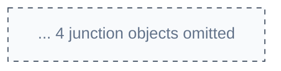

# Data Model Notation & Large Model Strategies

---

## Preferred Format: `flowchart LR`

Use `flowchart LR` (left-to-right) for data model diagrams. This format supports:
- Individual node color coding by object type
- Thick arrows (`==>`) for Master-Detail relationships
- Left-to-right flow for readability
- Subgraph grouping by object type or domain

---

## Relationship Arrows

| Label | Type | Arrow | Visual Meaning |
|-------|------|-------|---------------|
| `LK` | Lookup | `-->` | Optional parent, no cascade delete |
| `MD` | Master-Detail | `==>` | Required parent, cascade delete, roll-up summaries |
| Convert | Special | `-.->` | Conversion relationship (e.g., Lead converts) |

---

## Object Node Format

```
ObjectName["ObjectName<br/>(record count)"]
```

Example: `Account["Account<br/>(317K)"]`

---

## Object Type Color Coding

| Object Type | Fill | Stroke | Text |
|-------------|------|--------|------|
| Standard Objects | `#bae6fd` | `#0369a1` | `#1f2937` |
| Custom Objects (`__c`) | `#fed7aa` | `#c2410c` | `#1f2937` |
| External Objects (`__x`) | `#a7f3d0` | `#047857` | `#1f2937` |

---

## LDV (Large Data Volume) Indicators

Objects with >2M records display LDV indicators for performance awareness:

| Record Count | Display | Example Node |
|-------------|---------|-------------|
| < 2M | (none) | `Account["Account<br/>(317K)"]` |
| 2M - 10M | `LDV[~XM]` | `Activity["Activity<br/>LDV[~4M]"]` |
| 10M+ | `LDV[~XXM]` | `EventLog["EventLog<br/>LDV[~50M]"]` |

---

## OWD (Org-Wide Defaults) Display

Show sharing model on entities: `OWD:Private`, `OWD:Read`, `OWD:ReadWrite`, `OWD:Parent`

---

## Data Model Templates

| Template | Objects | Path |
|----------|---------|------|
| **Core** | Account, Contact, Opportunity, Case | `templates/datamodel/salesforce-erd.md` |
| **Sales Cloud** | + Lead, Product, Campaign | `templates/datamodel/sales-cloud-erd.md` |
| **Service Cloud** | Case, Entitlement, Knowledge | `templates/datamodel/service-cloud-erd.md` |
| **Campaigns** | Campaign, CampaignMember, CampaignInfluence | `templates/datamodel/campaigns-erd.md` |
| **Territory Mgmt** | Territory2, Territory2Model | `templates/datamodel/territory-management-erd.md` |
| **Party Model** | AccountContactRelation | `templates/datamodel/party-model-erd.md` |
| **Quote & Order** | Quote, QuoteLineItem, Order, OrderItem | `templates/datamodel/quote-order-erd.md` |
| **Forecasting** | ForecastingItem, OpportunitySplit | `templates/datamodel/forecasting-erd.md` |
| **Consent (GDPR)** | Individual, ContactPointEmail | `templates/datamodel/consent-erd.md` |
| **Files** | ContentDocument, ContentVersion | `templates/datamodel/files-erd.md` |
| **Scheduler** | ServiceAppointment, ServiceResource | `templates/datamodel/scheduler-erd.md` |
| **Field Service** | WorkOrder, ServiceAppointment, TimeSheet | `templates/datamodel/fsl-erd.md` |
| **B2B Commerce** | WebStore, WebCart, BuyerGroup | `templates/datamodel/b2b-commerce-erd.md` |
| **Revenue Cloud** | ProductCatalog, PriceAdjustment | `templates/datamodel/revenue-cloud-erd.md` |

Cross-ref: `sf-metadata` skill for querying live object definitions and field metadata from a connected org.

---

## Handling Large Data Models (10+ Objects)

### Strategy 1: Decompose by Functional Domain

Split a large model into focused sub-diagrams:

| Domain Diagram | Typical Objects | Template |
|----------------|-----------------|----------|
| Core CRM | Account, Contact, Opportunity, Lead | `datamodel/salesforce-erd.md` |
| Sales Cloud | + Product2, PricebookEntry, Quote, Order | `datamodel/sales-cloud-erd.md` |
| Service Cloud | Case, Entitlement, Knowledge, ServiceContract | `datamodel/service-cloud-erd.md` |
| Field Service | WorkOrder, ServiceAppointment, TimeSheet | `datamodel/fsl-erd.md` |

Then create a "master index" diagram showing only cross-domain junction objects.

### Strategy 2: Two-Level Zoom

1. **Level 1 (Overview)**: Show only primary objects (5-8 nodes) with relationship counts
   ```
   Account["Account<br/>(317K) | 6 relationships"]
   ```
2. **Level 2 (Detail)**: Drill into one subgraph with all child objects and fields

### Strategy 3: Spacing and Layout Tuning

For dense models, increase spacing:

```mermaid
%%{init: {"flowchart": {"nodeSpacing": 100, "rankSpacing": 90}} }%%
```

| Model Size | nodeSpacing | rankSpacing | Orientation |
|-----------|-------------|-------------|-------------|
| Small (< 6 objects) | 60 | 50 | `LR` or `TB` |
| Medium (6-12 objects) | 80 | 70 | `LR` |
| Large (12-20 objects) | 100 | 90 | `LR` |
| Very Large (20+) | Decompose into sub-diagrams | -- | Multiple `LR` |

### Strategy 4: Elide Low-Value Objects

For executive presentations, hide junction objects and show only primary entities. Use a note:


