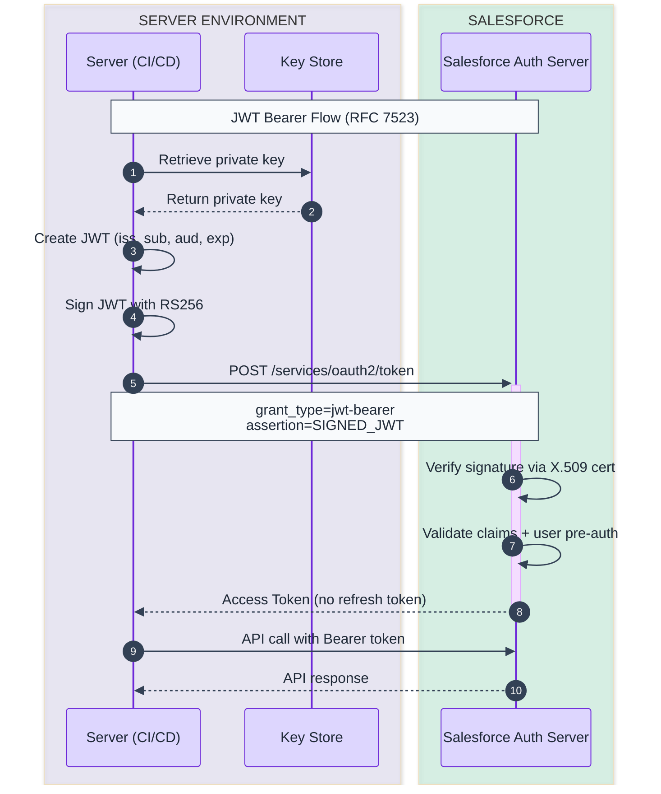
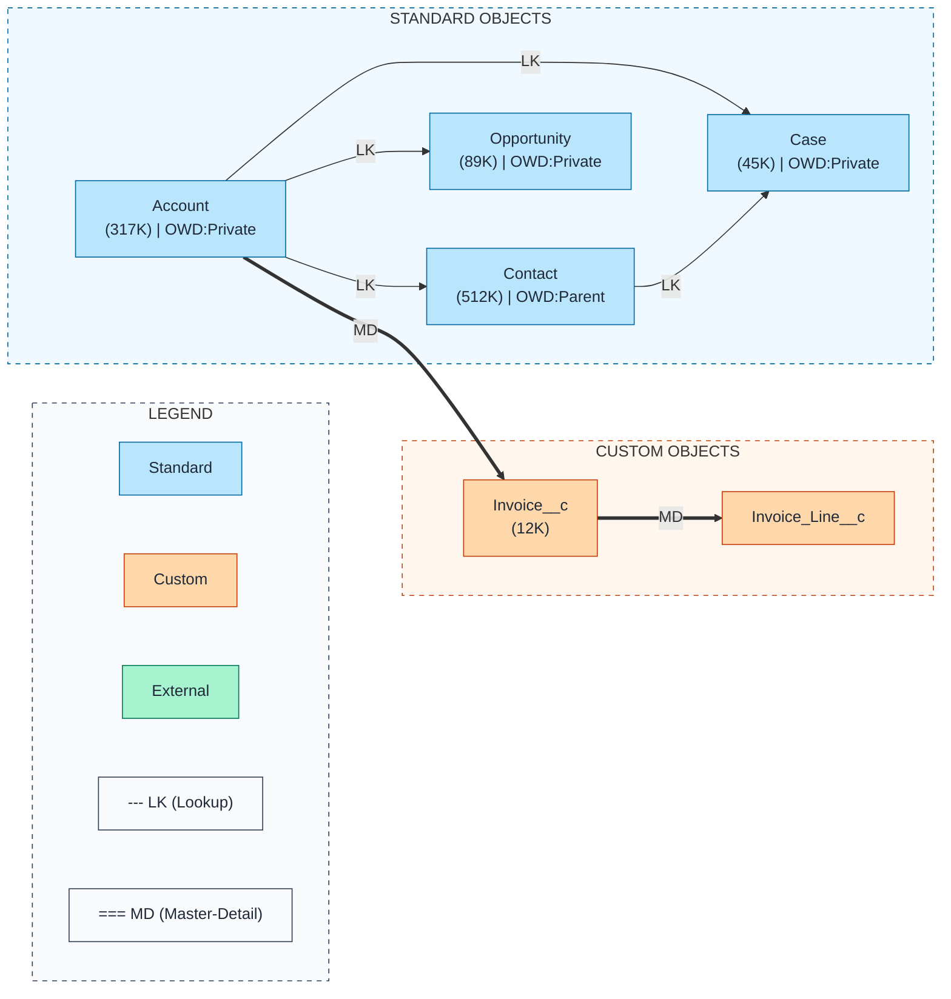
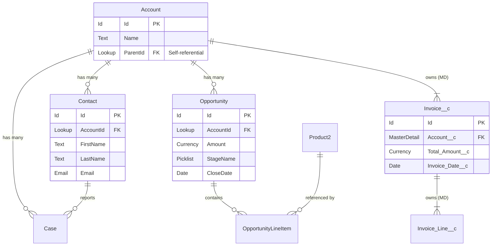
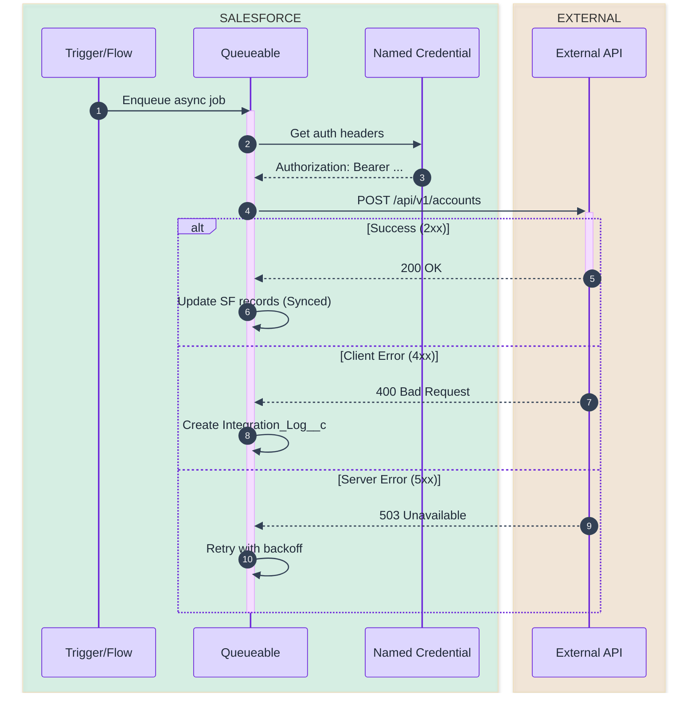
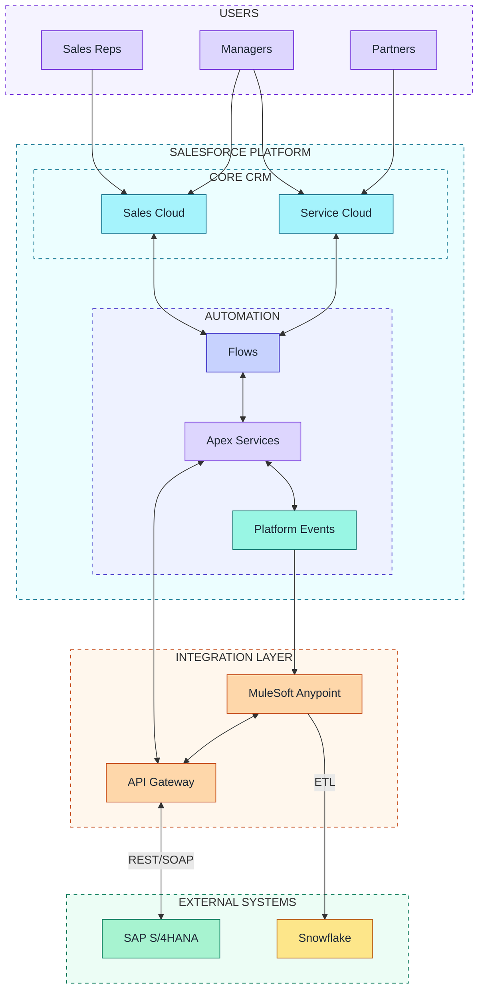
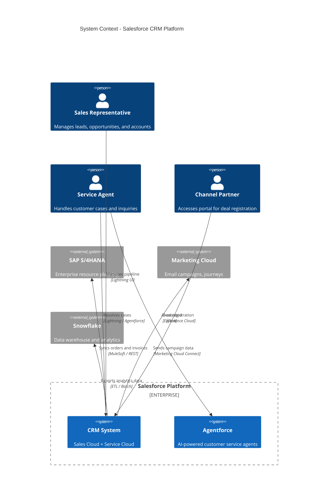

# Mermaid Diagram Examples for Salesforce

Complete, copy-paste-ready examples for the most common Salesforce diagram types.

---

## Example 1: JWT Bearer OAuth Flow (sequenceDiagram)

**Key syntax points**:
- `autonumber` adds step numbers automatically
- `->>` for synchronous request, `-->>` for response
- `+` / `-` after arrow for activate/deactivate shorthand
- `box rgba(...)` groups related participants
- `Note over X,Y:` for protocol details spanning participants

---

## Example 2: Salesforce Data Model ERD (flowchart LR -- preferred format)

**Key design decisions for ERDs**:
- Use `flowchart LR` (not `erDiagram`) so you can color-code nodes by object type
- `-->` for Lookup, `==>` for Master-Detail
- Show object name + record count only (no fields) to keep it clean
- Group by object type in subgraphs
- Always include a legend

---

## Example 3: Salesforce Data Model (erDiagram -- native cardinality)

Use this format when you need crow's-foot cardinality notation or when the audience prefers traditional ER diagrams.

**Cardinality symbols** (crow's foot notation):
- `||` = exactly one
- `|o` = zero or one
- `o{` = zero or many
- `|{` = one or many

**When to use `erDiagram` vs `flowchart LR`**:

| Consideration | `flowchart LR` | `erDiagram` |
|---------------|----------------|-------------|
| Color-coding by object type | Yes (via `style`) | No |
| Cardinality notation | Manual labels | Native crow's foot |
| Relationship distinction (LK/MD) | Arrow weight (`-->` vs `==>`) | Label text only |
| Field-level detail | Not practical | Built-in attribute blocks |
| Best for | Executive presentations, large models | Technical data modeling, small models |

---

## Example 4: Integration Sequence (sequenceDiagram with error handling)

**Key syntax points**:
- `alt` / `else` / `end` for branching paths
- `activate` / `deactivate` or `+` / `-` suffixes show processing duration
- `-)` for async fire-and-forget messages (e.g., `SF-)Bus: Publish Event`)
- `loop` for retry patterns: `loop Retry up to 3 times`
- `par` / `and` for parallel execution
- `critical` / `option` for critical regions
- `break` for early termination

---

## Example 5: System Landscape (flowchart TB with subgraphs)

---

## Example 6: C4 Context Diagram (experimental Mermaid feature)

C4 support in Mermaid is experimental and may not render in all viewers.

**C4 Syntax Reference**:

| Function | Purpose | Example |
|----------|---------|---------|
| `Person(id, name, desc)` | Human user | `Person(user, "Sales Rep", "...")` |
| `System(id, name, desc)` | Internal system | `System(crm, "CRM", "...")` |
| `System_Ext(id, name, desc)` | External system | `System_Ext(erp, "SAP", "...")` |
| `Container(id, name, tech, desc)` | Software container | `Container(api, "REST API", "Apex", "...")` |
| `ContainerDb(id, name, tech, desc)` | Database container | `ContainerDb(db, "Database", "PostgreSQL", "...")` |
| `Enterprise_Boundary(id, name)` | Org boundary | `Enterprise_Boundary(sf, "Salesforce")` |
| `Rel(from, to, label, tech)` | Relationship | `Rel(crm, erp, "syncs", "REST")` |

**C4 Diagram Levels**:

| Level | Mermaid Keyword | Scope | Audience |
|-------|----------------|-------|----------|
| Context | `C4Context` | Systems + people + external | Executives, stakeholders |
| Container | `C4Container` | Apps, databases, APIs within a system | Architects, tech leads |
| Component | `C4Component` | Classes, modules within a container | Developers |
| Dynamic | `C4Dynamic` | Runtime interaction flows | Architects, developers |
