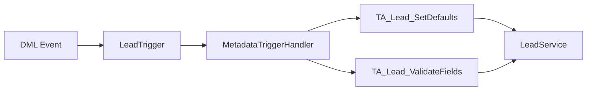

# sf-docs - Salesforce Documentation Generation

Generates documentation automatically from code, metadata, and context during development.

## Quick Reference

| Item | Details |
|------|---------|
| **Commands** | `/docs`, `/docs summary`, `/docs tech`, `/docs entry` |
| **Outputs** | Feature Summary, Technical Record, Change Entry |
| **Runs after** | `sf-apex`, `sf-flow`, `sf-metadata`, `salesforce-trigger-framework`, `sf-deploy` |
| **Orchestration position** | Step 6 -- documentation pass after implementation and deployment |
| **Input sources** | Apex classes, Flow XML, Custom Metadata, trigger actions, deploy logs |
| **Output locations** | `/docs/features/`, `/docs/technical/`, `/docs/changelog/` |
| **Related skills** | `sf-diagram` (architecture visuals), `sf-testing` (coverage data), `sf-deploy` (deploy manifests) |

---

## Orchestration Position

**sf-docs runs AFTER implementation is complete.** It is NOT part of the build pipeline -- it is the documentation pass that follows it.

```
0. sf-solution-design  -> Discover features, answer 8-question checklist
1. sf-metadata         -> Create objects/fields
2. sf-apex             -> Create Apex classes, trigger actions
3. sf-flow             -> Create Flows referencing Apex/metadata
4. sf-deploy           -> Deploy all metadata to org
5. sf-testing          -> Validate tests pass, coverage meets threshold
6. sf-docs             -> YOU ARE HERE: Generate documentation from what was built
```

### When to Invoke sf-docs

| Trigger | Action |
|---------|--------|
| Feature completed and deployed | `/docs` -- generate all three outputs |
| Sprint review approaching | `/docs summary` -- business-facing summary for stakeholders |
| Pull request ready | `/docs tech` -- technical record for reviewers |
| Release cut | `/docs entry` -- change entry for release notes |
| Post-hotfix | `/docs entry` + `/docs tech` -- document the fix and its technical footprint |

### What sf-docs Reads from Other Skills

sf-docs does not operate in isolation. It pulls context from the artifacts produced by upstream skills:

| Upstream Skill | What sf-docs Reads | Used In |
|----------------|-------------------|---------|
| **sf-apex** | Apex classes, trigger actions, ApexDoc comments, test classes | Technical Record (components, architecture, test coverage) |
| **sf-flow** | Flow XML metadata, flow descriptions, entry conditions | Technical Record (behavior), Feature Summary (automation descriptions) |
| **sf-metadata** | Custom Objects, Custom Fields, Custom Metadata, Permission Sets | Technical Record (dependencies), Feature Summary (what changed for users) |
| **salesforce-trigger-framework** | TA_* classes, Custom Metadata trigger configs, execution order | Technical Record (architecture pattern, execution order) |
| **sf-deploy** | Deploy logs, manifest files, deployment order | Technical Record (deployment section, rollback steps) |
| **sf-testing** | Test results JSON, coverage percentages, test scenarios | Technical Record (testing section) |
| **sf-diagram** | Mermaid diagrams (ERD, sequence, architecture) | Technical Record (embedded architecture diagrams) |

---

## Decision Framework: Which Output to Generate

Not every change needs all three outputs. Use this decision tree:

```
Is this a user-facing change?
  YES -> Generate Feature Summary
  NO  -> Skip Feature Summary

Does this touch code, metadata, or architecture?
  YES -> Generate Technical Record
  NO  -> Skip Technical Record (config-only changes may not need one)

Is this shipping in a release?
  YES -> Generate Change Entry
  NO  -> Skip Change Entry (internal refactors, tech debt)
```

### Common Scenarios

| Scenario | Feature Summary | Technical Record | Change Entry |
|----------|:-:|:-:|:-:|
| New feature (trigger + flow + metadata) | Yes | Yes | Yes |
| Bug fix affecting users | Yes | Yes | Yes |
| Internal refactor (no user impact) | No | Yes | No |
| New trigger action on existing object | Maybe | Yes | Yes |
| Permission set change | Yes | No | Yes |
| Data migration / data fix | No | Yes | No |
| New integration endpoint | Yes | Yes | Yes |
| Performance optimization | No | Yes | Maybe |

---

## Commands

```
/docs              # Generate all three outputs
/docs summary      # Feature Summary only (business-facing)
/docs tech         # Technical Record only (developer-facing)
/docs entry        # Change Entry only (release notes)
/docs review       # Review existing docs against quality checklist
```

### CLI Integration

After generating documentation, use these commands to manage the output:

```bash
# Create docs directories if they don't exist
mkdir -p docs/features docs/technical docs/changelog

# Stage documentation for commit
git add docs/

# Commit with conventional message
git commit -m "docs: add documentation for [feature-name]"

# View generated docs in terminal
cat docs/features/[feature-name].md
cat docs/technical/[feature-name].md
cat docs/changelog/$(date +%Y-%m).md
```

---

## Output 1: Feature Summary (Business-Facing)

**Audience:** Project managers, business analysts, operations managers, executives reviewing progress

**Purpose:** Explain what was delivered in terms anyone can understand

### Writing Rules - CRITICAL

**Language:**
- Write for someone who has never seen Salesforce Setup
- No technical terms without plain-English explanation
- No code references, API names, or developer jargon
- No acronyms unless defined AND necessary
- Use "the system" not "Salesforce" where possible

**Tone:**
- Confident and direct
- Focus on what users experience, not how it's built
- Active voice ("The system now does X" not "X has been implemented")
- Short sentences (under 20 words)

**Structure:**
- Lead with what changed for users
- Explain the benefit in human terms
- Keep it under one page
- Use tables for before/after comparisons

### Banned Phrases

Never use these in Feature Summary:

| Don't Use | Use Instead |
|-------------|----------------|
| "Implemented" | "Added" or "Now [verb]" |
| "Trigger" / "Apex" / "Flow" | "Automatic process" or "The system" |
| "Custom Metadata" | "Configuration" or "Settings" |
| "Framework" | "Foundation" or omit entirely |
| "Architecture" | Omit - not relevant to business |
| "Metadata-driven" | "Configurable" or "Adjustable without IT" |
| "Deployed" | "Released" or "Now available" |
| "Object" (Salesforce) | Use the business name: "Leads," "Accounts," "Policies" |
| "Record" | Use specific: "lead," "account," "policy" |
| "Field" | Use specific: "Lead Source," "Status" |
| "SOQL" / "Query" | "Lookup" or "Search" |
| "Governor limits" | Omit - internal concern |
| "Bulkified" | Omit - internal concern |
| "Test coverage" | Omit - internal concern |
| "Package" | "Add-on" or omit |
| "API" | Omit unless user-facing |

### Template

```markdown
# [Feature Name - in business terms]

**Status:** [Ready for Testing / Released]
**Release Date:** [Date]

---

## What's New

[2-3 sentences maximum. What can users do now that they couldn't before? Or: What does the system do now that it didn't before? Write this for someone who will never read past this section.]

---

## Why This Matters

[One paragraph. What problem does this solve? What was frustrating, slow, or error-prone before? What's better now? No technical details.]

---

## What Changed

| Before | After |
|--------|-------|
| [Old user experience] | [New user experience] |
| [Old manual step] | [New automatic behavior] |

---

## Who This Affects

[List roles and what changes for each. Be specific about job functions, not technical roles.]

| Role | What's Different |
|------|------------------|
| [Job title] | [Plain description of change] |

---

## What Happens Automatically

[List automatic behaviors in plain language. "When X happens, the system now Y."]

- When [user action or event], the system now [automatic result]
- When [user action or event], the system now [automatic result]

---

## What's NOT Included

[Set clear expectations. What does this NOT do yet?]

- This does not [limitation in plain terms]
- [Future capability] is planned for a later phase

---

## Questions?

Contact [team/person] for questions about this change.
```

### Example: Trigger Framework (Business Version)

```markdown
# Automatic Lead Data Completion

**Status:** Ready for Testing
**Release Date:** December 2024

---

## What's New

When someone creates a new lead, the system now automatically fills in the Lead Source and Status fields if they're left blank. This ensures every lead has complete information from the moment it's created.

---

## Why This Matters

Previously, leads created without a source or status would cause problems downstream. Assignment rules wouldn't work correctly, reports would show incomplete data, and someone had to manually clean up the gaps. Now the system handles this automatically.

---

## What Changed

| Before | After |
|--------|-------|
| Leads could be saved with blank Lead Source | Lead Source is automatically set if left blank |
| Leads could be saved with blank Status | Status is automatically set if left blank |
| Incomplete leads caused assignment rule failures | All leads have the minimum data needed for routing |

---

## Who This Affects

| Role | What's Different |
|------|------------------|
| Anyone creating leads | You'll notice Lead Source and Status are filled in automatically if you leave them blank |
| Sales managers | Reports will show consistent lead source data |
| Operations | Fewer leads falling through the cracks due to missing data |

---

## What Happens Automatically

- When a lead is created without a Lead Source, the system sets it to the default value
- When a lead is created without a Status, the system sets it to the default value
- This happens instantly when the lead is saved - no delay, no manual step

---

## What's NOT Included

- This does not change leads that already exist in the system
- This does not apply when you edit an existing lead (only new leads)
- Automatic lead assignment (routing to the right person) is planned for a future phase

---

## Questions?

Contact the project team for questions about this change.
```

**Compare to the technical version:**

| Technical (Bad for Business) | Business-Friendly (Good) |
|------------------------------|--------------------------|
| "Implemented Trigger Actions Framework with metadata-driven dispatch" | "The system now automatically fills in missing lead information" |
| "Custom Metadata configuration enables runtime bypass" | "Settings can be adjusted without waiting for IT" |
| "Bulkified for governor limit compliance" | [Omit - they don't care] |
| "TA_Lead_SetDefaults implements TriggerAction.BeforeInsert" | [Omit - they don't care] |

---

## Output 2: Technical Record (Developer-Facing)

**Audience:** Developers, system administrators, technical architects

**Purpose:** Complete implementation reference for maintenance, troubleshooting, and extension

### Writing Rules

- Technical terminology is appropriate
- Be precise and complete
- Include all components, paths, dependencies
- Document architecture decisions and rationale
- Include deployment and rollback procedures
- Assume reader knows Salesforce but not this project

### Cross-Referencing Upstream Skills

When generating the Technical Record, pull data from upstream skill artifacts:

**From sf-apex / salesforce-trigger-framework:**
- List every Apex class, trigger, and trigger action created
- Include the `TA_*` execution order from Custom Metadata
- Document the architecture pattern: `Trigger -> MetadataTriggerHandler -> TA_* -> Services -> DAL`
- Reference test classes and their coverage percentages

**From sf-flow:**
- List every Flow with its type (Record-Triggered, Screen, Autolaunched, Scheduled)
- Include entry conditions and trigger context (Before Save vs After Save)
- Note any Apex Actions invoked from Flows

**From sf-metadata:**
- List all Custom Objects, Custom Fields, Custom Metadata Types created
- Document field-level security requirements
- Include Permission Set assignments

**From sf-deploy:**
- Include the exact deployment order used
- Document any deployment flags or special considerations
- Provide the rollback procedure

**From sf-diagram (optional):**
- Embed Mermaid diagrams for architecture visualization
- Include ERD diagrams for data model documentation

### Template

```markdown
# Technical Record: [Feature Name]

**Generated:** [Timestamp]
**Commit/Branch:** [If known]
**Upstream skills used:** [sf-apex, sf-flow, sf-metadata, etc.]

---

## Summary

[2-3 sentences: What was built, what pattern was used, what it enables]

---

## Components

### Created

| Component | Type | Purpose |
|-----------|------|---------|
| [Name] | [Apex/Trigger/Flow/Metadata] | [What it does] |

### File Paths

```
force-app/main/default/
├── classes/
│   └── [files]
├── triggers/
│   └── [files]
└── customMetadata/
    └── [files]
```

---

## Architecture

**Pattern:** [Name]

**Flow:**
```
[Diagram or description]
```

**Design Decisions:**
- [Decision]: [Rationale]

---

## Behavior

### What It Does

[Detailed description of logic]

### Contexts/Events

| Context | Behavior |
|---------|----------|
| [Context] | [What happens] |

### Edge Cases

- [Case]: [Handling]

---

## Dependencies

### Packages

| Package | ID/Version | Required For |
|---------|------------|--------------|
| [Name] | [ID] | [Purpose] |

### Objects/Fields

| Object | Fields | Access |
|--------|--------|--------|
| [Object] | [Fields] | [Read/Write] |

### Permissions

| Permission | Reason |
|------------|--------|
| [Permission] | [Why needed] |

---

## Testing

| Test Class | Coverage |
|------------|----------|
| [Class] | [%] |

### Scenarios

| Scenario | Validates |
|----------|-----------|
| [Scenario] | [What it proves] |

---

## Deployment

### Order

1. [Step]
2. [Step]

### Verification

```bash
[commands]
```

### Rollback

1. [Step]
2. [Step]

---

## Extension

### Adding New [Behavior]

1. [Step]
2. [Step]

### Configuration

| Setting | Location | Effect |
|---------|----------|--------|
| [Setting] | [Where] | [What it does] |

---

## Limitations

- [Limitation]
```

---

## Output 3: Change Entry (Release Notes)

**Audience:** Anyone scanning release notes

**Purpose:** Brief summary of what shipped

### Writing Rules

- One bolded sentence summarizing the change
- 3-5 bullet points of specific changes
- Keep entire entry under 75 words
- Lead with user impact, not technical details
- Follow Salesforce release notes conventions: state what changed, who benefits, and any action required

### Template

```markdown
## [Feature Name]

**[One sentence: What users can now do or what the system now does]**

- [Change 1 - user-facing impact]
- [Change 2 - user-facing impact]
- [Change 3 - user-facing impact]
```

### Example

```markdown
## Automatic Lead Data Completion

**New leads now automatically receive default values for Lead Source and Status, ensuring complete data for routing and reporting.**

- Leads saved without a Lead Source get a default value automatically
- Leads saved without a Status get a default value automatically
- Applies to all new leads created in any way (manual, import, web form)
```

### Changelog File Convention

Change entries are appended to monthly changelog files:

```
docs/changelog/
├── 2024-12.md    # December 2024 changes
├── 2025-01.md    # January 2025 changes
└── 2025-02.md    # February 2025 changes
```

Each monthly file follows this structure:

```markdown
# Release Notes - [Month Year]

## [Date] - [Release Name or Sprint]

### [Feature 1]
**[Summary sentence]**
- [Change]
- [Change]

### [Feature 2]
**[Summary sentence]**
- [Change]
- [Change]

---

## [Earlier Date] - [Release Name or Sprint]

...
```

---

## Translating Technical to Business Language

When generating Feature Summary, translate technical concepts:

### Actions/Behaviors

| Technical Concept | Business Translation |
|-------------------|---------------------|
| Trigger fires on insert | When someone creates a new [record type] |
| Trigger fires on update | When someone edits a [record type] |
| Validation rule prevents save | The system checks that [condition] before saving |
| Flow runs after save | After saving, the system automatically [action] |
| Field default value | The system fills in [field] automatically |
| Required field | You must enter [field] before saving |
| Lookup filter | When selecting [related record], only [criteria] options appear |
| Assignment rule | The system automatically assigns [record] to [owner/queue] |
| Workflow email | The system sends an email when [condition] |
| Scheduled job | Every [frequency], the system [action] |

### Components

| Technical Term | Business Translation |
|----------------|---------------------|
| Apex class | Automatic process |
| Trigger | Automatic process |
| Flow | Automatic process |
| Custom Metadata | Configuration / Settings |
| Permission Set | Access settings |
| Profile | User type settings |
| Custom Object | [Use business name] |
| Custom Field | [Use field label] |
| Page Layout | Screen layout |
| Lightning Component | Screen section / Feature |
| Validation Rule | Data check / Requirement |
| Formula Field | Calculated field |
| Roll-up Summary | Automatic total |

### Patterns

| Technical Pattern | Business Translation |
|-------------------|---------------------|
| "Implemented X framework" | [Omit or] "Added foundation for [capability]" |
| "Refactored for performance" | "Improved speed of [feature]" |
| "Added error handling" | "Better error messages when [scenario]" |
| "Bulkified processing" | [Omit - internal] |
| "Optimized queries" | "[Feature] now loads faster" |
| "Added test coverage" | [Omit - internal] |
| "Metadata-driven configuration" | "Settings can be adjusted without code changes" |
| "Enabled bypass mechanism" | "Can be turned off during data imports" |

### Trigger Actions Framework Translations

When documenting features built with the `salesforce-trigger-framework` skill, apply these specific translations:

| TAF Concept | Business Translation |
|-------------|---------------------|
| TA_Lead_SetDefaults (BeforeInsert) | "When a new lead is created, the system fills in default values" |
| TA_Account_ValidateFields (BeforeUpdate) | "When someone edits an account, the system checks the data is valid" |
| TA_Opportunity_CreateTasks (AfterInsert) | "When a new opportunity is created, the system creates follow-up tasks" |
| sObject_Trigger_Setting__mdt bypass | "This behavior can be temporarily turned off for bulk data imports" |
| Trigger_Action__mdt ordering | [Omit - internal execution detail] |
| MetadataTriggerHandler dispatch | [Omit - internal plumbing] |

---

## Inferring Business Impact from Code

Connect technical implementation to business outcome:

### What the Code Does to What It Means for Users

| Code Behavior | User Impact |
|---------------|-------------|
| Sets default field values | Users don't have to fill in every field manually |
| Validates required fields | Prevents incomplete records that cause problems later |
| Auto-creates related records | Setup steps that were manual now happen automatically |
| Sends notification | Users get alerted when [event] without checking manually |
| Updates parent record | Totals and summaries stay up-to-date automatically |
| Assigns owner | Records get routed to the right person without manual intervention |
| Enforces sharing rules | Users see only the records they're supposed to see |

### Object to Business User Mapping

Customize this table for your project's industry/context:

| Salesforce Object | Typical Business Users |
|-------------------|------------------------|
| Lead | Sales team, marketing, business development |
| Account | Account managers, service reps |
| Contact | Sales reps, customer service |
| Opportunity | Sales reps, sales managers |
| Case | Service reps, support team |
| Task/Event | All users with activity management |
| Custom Objects | [Map to your business domain] |

---

## Quality Checklist

### Feature Summary (Business)

- [ ] Could a non-technical manager understand every sentence?
- [ ] Are there ZERO technical terms (trigger, apex, flow, metadata, object, field)?
- [ ] Does it explain what changed for users, not what developers built?
- [ ] Is "Why This Matters" written in terms of user problems solved?
- [ ] Is "Who This Affects" using job titles, not system roles?
- [ ] Is it under one page?
- [ ] Could someone skim just the headers and tables and understand it?

### Technical Record (Developer)

- [ ] All components listed with correct file paths?
- [ ] Architecture and patterns documented?
- [ ] Dependencies explicit and complete?
- [ ] Deployment order accurate?
- [ ] Rollback procedure would actually work?
- [ ] Extension points documented?
- [ ] Cross-references to upstream skills included?
- [ ] sf-diagram visuals embedded where helpful?

### Change Entry (Release Notes)

- [ ] Under 75 words total?
- [ ] Lead sentence describes user impact (not technical implementation)?
- [ ] Bullet points are user-facing changes?
- [ ] Appended to correct monthly changelog file?

---

## Output Location

| Output | Location |
|--------|----------|
| Feature Summary | `/docs/features/[feature-name].md` |
| Technical Record | `/docs/technical/[feature-name].md` |
| Change Entry | Appended to `/docs/changelog/[YYYY-MM].md` |

---

## Integration with sf-deploy

When sf-deploy completes a deployment, sf-docs can auto-generate documentation from the deploy results:

```bash
# After a successful deployment, generate docs from the deploy manifest
sf project deploy start --source-dir force-app --target-org sandbox \
  --json > deploy-result.json

# Then invoke sf-docs to read the deploy result and generate Technical Record
/docs tech
# sf-docs reads deploy-result.json to populate:
#   - Components list
#   - Deployment order
#   - Verification commands
```

### Post-Deployment Documentation Workflow

```
1. sf-deploy completes successfully
2. sf-testing confirms all tests pass
3. Run `/docs` to generate all documentation
4. Review generated docs against Quality Checklist
5. Stage and commit: git add docs/ && git commit -m "docs: [feature-name]"
6. Include doc links in PR description or sprint review
```

---

## Integration with sf-diagram

For Technical Records that describe complex architectures, invoke sf-diagram to generate visuals:

```
# Generate ERD for the data model documented in Technical Record
/diagram erd Account Contact Opportunity

# Generate sequence diagram for an integration flow
/diagram sequence "External System -> Named Credential -> Apex -> Platform Event"

# Embed the resulting Mermaid code directly in the Technical Record
```

The sf-diagram output can be embedded in the Technical Record's Architecture section:

```markdown
## Architecture

**Pattern:** Trigger Actions Framework


```

---

## Versioning and Document Lifecycle

### When to Update Existing Documentation

| Change Type | Feature Summary | Technical Record | Change Entry |
|-------------|:-:|:-:|:-:|
| Bug fix to documented feature | Update | Update | New entry |
| Enhancement to documented feature | Update | Update | New entry |
| Breaking change | New version | Update + migration notes | New entry |
| Deprecation | Update with sunset date | Update with removal plan | New entry |
| Configuration change only | No change | Update | Optional |

### Document Naming Convention

```
docs/
├── features/
│   ├── automatic-lead-completion.md
│   ├── opportunity-stage-validation.md
│   └── case-auto-assignment.md
├── technical/
│   ├── automatic-lead-completion.md
│   ├── opportunity-stage-validation.md
│   └── case-auto-assignment.md
└── changelog/
    ├── 2024-12.md
    ├── 2025-01.md
    └── 2025-02.md
```

Use kebab-case for file names. Match names between features/ and technical/ directories so they are easy to cross-reference.

---

## Sources

This skill's documentation standards are informed by:

- [Complete Guide to Salesforce Documentation - Salesforce Ben](https://www.salesforceben.com/complete-guide-to-salesforce-documentation/)
- [Functional and Technical Documentation for Salesforce Projects - Salesforce Ben](https://www.salesforceben.com/functional-and-technical-documentation-for-salesforce-projects-whats-the-difference/)
- [Salesforce Best Practices: System Documentation - Cloud Giants](https://www.cloudgiants.com/blog-detailed/salesforce-best-practices-system-documentation)
- [Salesforce DevOps Documentation Best Practices - DevOps Launchpad](https://devopslaunchpad.com/blog/salesforce-devops-documentation-best-practices/)
- [Effective Documentation Strategies for Large Salesforce DevOps Teams - Gearset](https://gearset.com/blog/documentation-for-large-teams/)
- [Salesforce Release Management Best Practices - Minuscule Technologies](https://www.minusculetechnologies.com/blogs/salesforce-release-management-best-practices)
- [Documentation Ideas and Best Practices - Trailhead Community](https://trailhead.salesforce.com/trailblazer-community/feed/0D54S00000BtiCUSAZ)
